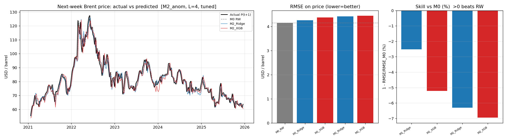
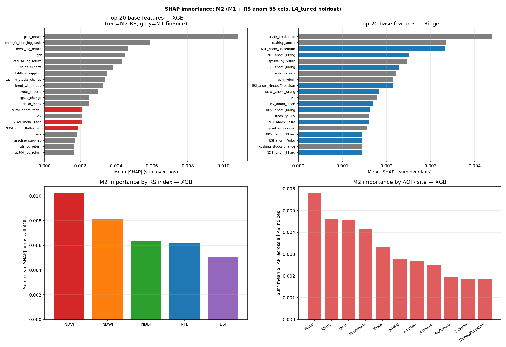

# 核心实证层基线记录（Flat + Deep Early-Fusion Baselines）

> **定位**：核心实证层对照（M0–M4）：**表格扁平融合**（Ridge / XGB）+ **深度 early-fusion**（LSTM）。方法集成层（模态感知表示级融合）必须超越本层。
> **代码**：`04_code/src/backtest/`（公平回测内核）+ `run_baseline.py`（Ridge/XGB M0–M4）+ `run_deep_baseline.py`（LSTM early-fusion M1–M4）+ `sweep_baseline.py`（M1 稳健性）
> **产物**：`05_outputs/baselines/`（`baseline_metrics_*.csv` / `baseline_deep_metrics*.csv` / `baseline_predictions_*.csv` / `baseline_backtest_*.png` / `backtest_deep*.png` / `baseline_loao_*.csv` / `sweep_*`）
>
> **更新**：2026-07-03
>
> 进度：M0 / M1 / M2（anom 主 + literature/level + CW + LOAO）/ M3（主基线 + sweep + SHAP + LOCHO）/ M4（主基线 + SHAP + sweep + LOMO）/ 深度 LSTM early-fusion

---


## 1. 定位与作用

- **表格扁平融合（flat feature fusion）**：把所选模态的特征拼成一张宽表（lag 0..3 展平）喂给 Ridge / XGBoost。
- **深度 early-fusion**：同一批数值列 reshape 为 `[lookback, features]` 序列，喂进**一个共享 LSTM**（无模态专属编码器）——研究方案 §6.1 的 LSTM/TFT-Early 对照，是表格扁平融合的**深度版标尺**（RQ2）。
- 两类基线共用同一协议与评估内核，回答：①能否超过随机游走 M0（RQ1）；②加模态相对 M1 是否有**统计显著的嵌套增量**（Clark-West）；并为模态感知融合提供同一把标尺。


## 2. 代码架构

一个公平回测内核 + 按模态切数据；M0 内嵌，M1–M4 共用同一 pipeline。

```
04_code/
  src/backtest/
    data.py     读 merge 矩阵、modality→列选择、M2 特征合约、lag 展平、生成 r_{t+1}、缺失填充
    models.py   M0 规则（内嵌）+ Ridge/XGB Pipeline 工厂 + tune 网格
    rolling.py  rolling-origin 循环（含内层时间验证调参）
    metrics.py  RMSE/MAE/DirAcc、DM vs M0、Clark-West vs M1（嵌套增量=B1）
  scripts/
    run_baseline.py       单入口：--modality M1|M2|M3|M4 [--m2-features anom|level|all|literature] [--leave-one-aoi-out]
    run_deep_baseline.py  深度 early-fusion：同上模态/协议，输出 baseline_deep_*
    sweep_baseline.py     M1 lookback/调优稳健性，复用同一内核
```

- **M0 内嵌**：随机游走是每周输出的基准（r_hat=0 → P_hat=P_t），不占单独脚本，永不与协议 drift。
- **M1–M4 仅差数据**：差别只在 `data.select_features()` 选哪些列；回测循环完全相同 → 公平。
- 验证：新内核跑 M1 复现旧结果（L4_tuned Ridge 4.332 / XGB 4.771 / 257 周完全一致；L1 与旧单表 4.883/4.787/260 周完全一致）。


## 3. 锁定协议


| 项       | 设定                                                                         |
| ------- | -------------------------------------------------------------------------- |
| 数据源     | **统一合并矩阵** `weekly_feature_matrix.csv`（365×320，无泄漏）                        |
| 窗口      | 2019.1–2025.12（测试周随 lookback 在 249–260 之间；L4=257）                          |
| 切分      | rolling-origin（expanding，`min_train=104` 周；tune 时 `retrain_every=13`）      |
| 滞后      | lookback = **4 周**（导师设定），每特征 lag 0..3 展平                                   |
| 目标      | 单任务回归 r_{t+1}=log(P_{t+1}/P_t)，还原 P̂_{t+1}=P_t·e^{r̂}                      |
| 模型      | M0（随机游走）+ Ridge + XGB（`--tune`）+ LSTM early-fusion（`run_deep_baseline.py`） |
| 指标      | 还原价格上 RMSE/MAE/DirAcc、相对 M0 skill、DM(vs M0)、**Clark-West(vs M1，嵌套)**       |
| **主对照** | `L4_tuned`（lookback=4 + tune，当前最强扁平基线）                                     |


## 4. 数据输入与 M1 列统一（34 vs 38 说明）

- M1–M4 一律从合并矩阵读，按字典 `modality` 字段选列；不用 `target_*`、不用 `mask`（`avail_*`）。
- **M1 = 34 列（merge）vs 38 列（单表 `m1_weekly_features.csv`）**：差异是 4 个 `avail_*`（market/eia_weekly/sp500/dollar_index）。它们在 merge 里归为 `mask`，且在 2019–2025 窗口内**恒为 1（零方差）**，单表脚本里的 `VarianceThreshold` 本就会丢弃 → **34 与 38 有效特征等价**。统一从 merge 读以消除歧义（这也是为何 L1 两版数值完全一致）。


## 5. M2 特征合约（按 channelB plan §3/§4）

`--m2-features` 选项（M2/M4 的遥感列）：


| 模式           | 列数  | 内容                                                 | 用途                          |
| ------------ | --- | -------------------------------------------------- | --------------------------- |
| **anom**（默认） | 55  | `{NDVI,NDWI,NDBI,BSI,NTL}_anom_{11 AOI}`           | **主分析**                     |
| literature   | 4   | `NTL_anom` of Fujairah/RasTanura/Rotterdam/Houston | C1 文献精选 arm                 |
| level        | 55  | `{idx}_{aoi}` 原始水平                                 | C3 level vs anom robustness |
| all          | 110 | anom + level                                       | robustness                  |


剔除：55 level（主分析）、22 age（时效非信号）、22 avail（窗内近零方差）。这修正了早期误用全 154 列的问题。

## 6. 方法与无泄漏要点

- **目标** `r_next = brent_price.shift(-1)` 推出，矩阵不含未来标签；rolling-origin 测试点 t 只用 τ≤t-1（其 r_{τ+1} 已实现）训练 → 严格 walk-forward。
- **管线内防泄漏**：`Pipeline([VarianceThreshold, StandardScaler, model])` 仅在训练折内 fit；lag 只取历史。
- **缺失**：RS anomaly 早期零星缺失 → ffill（历史值、无泄漏）+ 残留填 0（中性，仅落 warmup）→ 各配置落在**完全相同测试周**（差异只来自特征内容）。
- **tune**：训练折尾部 52 周作 time-aware 验证；Ridge alpha∈{0.1,1,10,100,1000}，XGB 小网格。
- **检验**：DM(HLN) 用于非嵌套对 M0；**Clark-West（MSPE-adjusted）用于嵌套对 M1**——嵌套模型 DM 有偏，CW 校正大模型估计零值参数的偏差，是「加模态是否显著」的正确检验（=B1）。


## 7. 结果 A：M1 稳健性 sweep（merge 统一数据源）

各 config 用自身可用测试周（lookback 越大 warmup 越多）；skill 相对各自 M0。


| config           | 维度  | test周 | M0    | Ridge RMSE | Ridge skill | XGB RMSE | XGB skill |
| ---------------- | --- | ----- | ----- | ---------- | ----------- | -------- | --------- |
| L1_all           | 34  | 260   | 4.137 | 4.883      | −18.0%      | 4.787    | −15.7%    |
| L4_all           | 136 | 257   | 4.152 | 5.697      | −37.2%      | 4.857    | −17.0%    |
| L8_all           | 272 | 253   | 4.172 | 6.887      | −65.1%      | 4.833    | −15.8%    |
| L12_all          | 408 | 249   | 4.181 | 7.120      | −70.3%      | 4.742    | −13.4%    |
| L4_returns       | 136 | 257   | 4.152 | 5.897      | −42.1%      | 4.797    | −15.5%    |
| **L4_tuned**     | 136 | 257   | 4.152 | **4.332**  | **−4.4%**   | 4.771    | −14.9%    |
| L4_returns_tuned | 136 | 257   | 4.152 | 4.453      | −7.0%       | 4.666    | −12.4%    |


- **Ridge 随 lookback 单调恶化**（4.88→7.12）：高维共线 + 水平外推拖垮线性模型。
- **XGB 对 lookback 几乎免疫**（4.74–4.86）：树模型对高维冗余鲁棒。
- **调参是最有效干预**：Ridge 5.70→**4.33**（skill −37%→−4.4%），强正则压住共线/外推。
- 结论与早期单表版一致（数字因 merge 257 周略变，趋势不变）。

sweep overview

## 8. M2 结果（M1 + 遥感，B3/B4）

> **配套文档**：Channel B 数据与 EDA 见 `2026-06-22_channelB_mechanism_plan.md`  
> **代码**：`04_code/scripts/run_baseline.py --modality M2` + `04_code/scripts/m2/`  
> **产物**：`05_outputs/baselines/m2/`（`baseline_metrics_*.csv` / `baseline_predictions_*.csv` / `backtest_*.png` / `baseline_loao_*.csv` / `shap_*.csv` / `shap_anom.png`）  
> **进度**：B0/B1/B2/B3(DM+CW+LOAO) ✅；B3 SHAP ✅；C2 降维对照 ✅；C3 lookback × contract sweep ✅；**B4 水体掩膜稳健性** ✅（全部 2026-06-23）

### 8.1 协议（M2 专项）

主协议与 §3 完全相同，以下仅列 M2 差异部分。

| 项 | 设定 |
|---|---|
| **M2 主分析列** | `{NDVI,NDWI,NDBI,BSI,NTL}_anom_{11 AOI}` 共 **55 列**（站点扩展窗 z-score，expanding past-only，防泄漏） |
| **对照臂** | C1 `literature`（4 NTL_anom 文献精选）、C3 `level`（55 原始水平） |
| **增量检验** | DM(HLN) vs M0（非嵌套参考），**Clark-West vs M1**（嵌套增量，正确检验）|
| **站点定位** | leave-one-AOI-out（全 55 anom，retrain_every=26 加速，内部对齐基线）|
| **可解释性** | SHAP 固定 holdout（train≤2023-12，test≥2024-01，L4_tuned，XGB+Ridge）|

**M2 特征合约决策依据**（详见 `channelB_mechanism_plan.md` §3 B3）：
- 主分析用 55 anom（去站点规模 + 去季节，过去-only expanding z-score）
- 剔除 55 level（尺度不可比 + 季节性 + 与 anom 冗余）、22 age（时效非信号）、22 avail（窗内近零方差）

### 8.2 核心结果（B3 主交付）

主协议 L4_tuned，retrain_every=13，**257 共同测试周**（2021–2025），M0 RMSE=4.152。  
CW_p = Clark-West 单边 p（越小 = 大模型即 M1+RS 越显著优于 M1）。

| 配置 | Ridge RMSE | Ridge skill | Ridge CW_p(vs M1) | XGB RMSE | XGB skill | XGB CW_p(vs M1) | XGB DirAcc |
|---|---|---|---|---|---|---|---|
| M1（嵌套基线） | 4.332 | −4.4% | — | 4.771 | −14.9% | — | 0.525 |
| **M2 anom (55)** | 4.411 | −6.3% | 0.212 | 4.643 | −11.8% | **0.006** ✅ | 0.506 |
| M2 literature (4) | **4.318** | **−4.0%** | 0.146 | 4.553 | −9.7% | **0.001** ✅ | **0.545** |
| M2 level (55) † | 4.361 | −5.0% | 0.061 | 4.531 | −9.1% | **0.004** ✅ | 0.514 |

> **† level 合约数据状态**：当前标准矩阵（`weekly_feature_matrix.csv`，365×221）仅含 55 个 anom 列；55 个 level（原始水平值）列**未纳入矩阵**，`m2_columns(dico, "level")` 返回空列表。上表 level 行数值来自旧版矩阵（EIA 修复前），**当前不可复现**。sweep 实验进一步证实：现版矩阵下 level 合约等价于 M1（RMSE 完全相同，CW_p = NaN）。若需 C3 复现，须重建矩阵纳入 level 列（优先级低）。

产物：`05_outputs/baselines/m2/baseline_metrics_anom.csv` / `baseline_metrics_literature.csv`



**关键发现**：

1. **仍无配置超过 M0**（所有 skill &lt; 0）——符合周度油价 M0 极强的预期。
2. **遥感对 XGB 有统计显著嵌套增量**：anom/literature 两种合约的 XGB Clark-West p 全 &lt;0.01 → 加遥感让 XGB 显著优于 M1_XGB。（level 合约结果来自旧版矩阵，见上方 † 备注。）
3. **对 Ridge 不显著**（anom CW p=0.21，literature CW p=0.15）：高维 RS 对线性模型主要是噪声，正则化不足以利用弱信号。
4. **少而精 > 全量**（支持 C1 / P058）：`literature`（仅 4 个 NTL_anom）跨配置最优——Ridge RMSE 4.318（**唯一微超 M1 的配置**），XGB CW p=0.001（最显著），DirAcc=0.545（最高）。
5. **方法学含义（支撑 RQ2）**：扁平拼接下遥感增量边际且模型相关，强化「需要模态感知融合」的论据。

### 8.3 leave-one-AOI-out（B3 站点定位）

全 55 anom，每次去掉一个 AOI，retrain_every=26 自洽基线（full RMSE Ridge=4.451 / XGB=4.867）。  
`dRMSE > 0` = 去掉该站变差 = 该站有正贡献。

| 去掉站点 | Ridge dRMSE | XGB dRMSE | 解读 |
|---|---|---|---|
| Rotterdam | +0.032 | −0.275 | Ridge 微正；XGB 去掉反而改善（噪声） |
| Jurong | +0.040 | **−0.323** | XGB 最大改善——非石油核心港，最大噪声源 |
| Basra | +0.031 | −0.278 | Ridge 微正；XGB 噪声 |
| NingboZhoushan | −0.034 | **−0.326** | 两个模型均无正贡献；非石油港噪声 |
| Fujairah | −0.037 | −0.302 | XGB 下去掉反改善（去掉减噪） |
| RasTanura | −0.016 | −0.315 | — |
| Houston | −0.008 | −0.277 | — |

产物：`05_outputs/baselines/m2/baseline_loao_anom.csv`

**LOAO 结论**：
- **XGB：去掉任一站都改善（dRMSE 全负）** → 全 55 anom 对 XGB 整体偏噪声，无单站是「必要正贡献」。
- 改善最多：**NingboZhoushan / Jurong**（非石油核心港，与 plan 预期一致）。
- **Ridge：幅度小（±0.04）**，去掉 Jurong/Rotterdam/Basra 略变差（微弱正贡献）。
- 综合强化「少而精」结论——文献精选 4 个 NTL_anom 优于全 55。

### 8.4 SHAP 可解释性（B3）

脚本 `04_code/scripts/m2/shap_m2.py`；固定 holdout（train≤2023-12，test=2024–2025，L4_tuned）。

产物：`05_outputs/baselines/m2/`
- `shap_xgb_by_feature.csv` — 所有基础特征的 XGB 平均|SHAP|（lags 加总）
- `shap_ridge_by_feature.csv` — Ridge 版
- `shap_xgb_m2_by_index.csv` — 按 RS 指数（NTL/NDBI/BSI/NDWI/NDVI）汇总
- `shap_xgb_m2_by_aoi.csv` — 按 AOI/站点汇总
- `shap_topN_anom.csv` — 前 N 个 M2 特征排名（供 robustness_m2.py C2 对照用）
- `shap_anom.png` — 4 面板概览图



**运行参数**：train 258 周（2019–2023），test 103 周（2024–2025），L4_tuned；Ridge α=1000（强正则），XGB depth=2 n_est=200；holdout log-return RMSE：Ridge 0.0418 / XGB 0.0421。

**M2 各 RS 指数重要性（XGB，按 sum mean|SHAP|）**：

| RS 指数 | sum mean\|SHAP\| | 排名 |
|---|---|---|
| **NDWI**（水面动态） | 0.00595 | 1 |
| **NDVI**（植被） | 0.00454 | 2 |
| **NTL**（夜光） | 0.00336 | 3 |
| **NDBI**（建成区） | 0.00275 | 4 |
| **BSI**（裸地/堆场） | 0.00226 | 5 |

**M2 各 AOI/站点重要性（XGB，sum mean|SHAP|）**：

| 排名 | AOI | sum mean\|SHAP\| | 站点类型 |
|---|---|---|---|
| 1 | **Ulsan** | 0.00341 | 韩国炼厂枢纽 |
| 2 | **Kharg** | 0.00330 | 伊朗出口码头 |
| 3 | **Yanbu** | 0.00283 | 沙特红海出口 |
| 4 | Fujairah | 0.00184 | 中东集散港 |
| 5 | RasTanura | 0.00161 | 沙特主出口港 |
| 6 | Houston | 0.00147 | 美国炼厂/出口 |
| … | … | … | … |
| 10 | **NingboZhoushan** | 0.00057 | 中国进口港（最低） |
| 11 | **Basra** | 0.00055 | 伊拉克出口港（最低） |

**Top-5 M2 基础特征（XGB）**：
`NDWI_anom_Kharg`(0.00171) > `NDWI_anom_Yanbu`(0.00170) > `NDVI_anom_Ulsan`(0.00169) > `NTL_anom_RasTanura`(0.00118) > `NDWI_anom_Jamnagar`(0.00111)

**整体上 M1 金融特征仍主导 Top-4**：`gold_return`(0.00575) > `futures_spread`(0.00484) > `vix`(0.00276) > `brent_wti_spread`(0.00265)；M2 特征从第 8 名（NDWI_anom_Kharg）才进入前 15。

**SHAP 解读**：
1. **NDWI（水面反射）意外排第一** — 中东/韩国出口码头的水面变化可能捕获装卸吃水动态；但也可能是潮汐/水色噪声（B0 已提示 NDWI 高方差噪声风险）。NTL（文献最推荐）仅排第三，说明当前 test 期（2024–2025）夜光信号弱于 EDA 预期。
2. **AOI 排序与文献不同** — Ulsan/Kharg 超过文献推荐的 Fujairah/RasTanura，可能与 2024 年韩国炼厂动态及伊朗出口变化有关（2023–24 红海/Houthi 事件）；与 LOAO 结论互补（LOAO 在 2021–2025 全段，SHAP 在 2024–2025 最近段，时段不同导致排序差异）。
3. **NingboZhoushan 最弱** — 与 LOAO「去掉 Ningbo 最大改善」一致 ✅，强化"非石油核心港是主要噪声源"结论。
4. **文献 NTL 精选的有效性**：NTL_anom_RasTanura(4th) 和 NTL_anom_Houston(8th) 仍在 top-10，支持 `literature` 四站点配置的预测表现（CW p=0.001，最显著）。

### 8.5 RQ1 结论（M2，可写入 Results §4.1）

> 在统一无泄漏协议（2019–2025、4 周滞后、rolling-origin L4_tuned）下，**遥感（Channel B）的扁平特征融合不能战胜随机游走 M0**（所有配置 skill &lt; 0）。  
> 但相对金融基线 M1，**遥感对 XGBoost 提供了统计显著的嵌套增量**（Clark-West p：anom 0.006 / 文献精选 NTL_anom 0.001），**对线性 Ridge 则不显著**（p > 0.14），说明增量信号弱且需鲁棒模型才能利用。  
> **少而精**的 4 个夜光异常站点（Fujairah/RasTanura/Rotterdam/Houston）优于全 55 列；leave-one-AOI-out 进一步显示非石油核心港（Ningbo/Jurong）是主要噪声源；SHAP 结果补充了指数与站点维度的可解释性。  
> 这支持本研究核心动机：扁平拼接无法充分利用遥感，需要**模态感知的表示级融合**（RQ2）。

### 8.6 C2 降维对照（回应 P058）

脚本 `04_code/scripts/m2/robustness_m2.py`；产物 `05_outputs/baselines/m2/c2_summary.csv` / `c2_overview.png`。

**协议**：L4，fixed hyperparams（Ridge α=1000，XGB depth=2/n_est=200），257 共同测试周。M0 RMSE=4.152，M1_Ridge=4.332，M1_XGB=4.717（注：固定参数而非内层调参，故 M1_XGB 与主结果 4.771 略有差异；C2 各臂内部对比公平）。

| 臂 | M2 输入 | Ridge RMSE | Ridge CW_p | XGB RMSE | XGB CW_p |
|---|---|---|---|---|---|
| all-55 | 55 anom cols | 4.411 | 0.212 | 4.587 | **0.0036** |
| pca-90 | 55 → PCA 90% var | 4.412 | 0.188 | **4.535** | **0.0000026** ✅✅ |
| elastic | 55 → ElasticNet sel | 4.411 | 0.212 | 4.587 | **0.0036** |
| shap-top20 | top-20 SHAP | **4.376** | 0.249 | **4.521** | **0.0007** ✅ |

**C2 结论**（直接回应 P058「SHAP≠PCA」）：

1. **Ridge：四臂几乎无差异**（RMSE 4.376–4.412，CW_p 全不显著）。α=1000 的强 L2 正则已通过收缩隐式处理了共线性；PCA/ElasticNet 在其上没有增益。**shap-top20 给出最好的 Ridge RMSE（4.376）**——减少输入让正则化更聚焦。
2. **XGB：PCA 显著提升 CW 显著性**（p=2.6×10⁻⁶，远优于 all-55 的 0.0036）。去相关之后 XGB 能更纯粹地利用正交信号分量；这正是 P058 指出的「PCA 解决共线性、SHAP 提供可解释性、两者解决不同问题」的实证体现。
3. **Elastic ≡ all-55**：ElasticNet(α=0.05) 在 356 特征/258 样本上几乎产生全零系数（高 α 过度压缩），SelectFromModel 退化为全保留 → 结果与 all-55 完全相同。可在方法章节注明「ElasticNet 选择器在此维度/样本量比例下退化」。
4. **shap-top20 既节省特征又提升预测**（XGB CW_p 0.0007 &lt; all-55 的 0.0036）——支持 SHAP 选择的特征确实是信息更纯的子集。

**写作建议（P058 回应段）**：Ridge 的鲁棒性来自强 L2 正则，PCA 对 XGB 有实质增益，SHAP 提供事后可解释性但与降维各司其职；三种策略并列，说明"55 anom 的高维共线问题"在 XGB+PCA 下可通过降维缓解，在 Ridge+shap-top20 下通过数据驱动特征选择缓解。

### 8.7 C3 lookback × feature-contract sweep

脚本 `sweep_m2.py --quick`（retrain_every=26），产物 `05_outputs/baselines/m2/sweep_m2_summary.csv` / `sweep_m2_overview.png`。

M1 RMSE（quick，同周对齐）：L=1 → 4.255 Ridge / 4.568 XGB；L=4 → 4.557 / 5.222；L=8 → 4.693 / 5.600。

| contract | L | Ridge RMSE | Ridge CW_p | XGB RMSE | XGB CW_p |
|---|---|---|---|---|---|
| anom | **1** | **4.230** | 0.108 | **4.521** | **0.003** |
| anom | 4 ← 主协议 | 4.451 | **0.015** | 4.867 | **&lt;0.001** |
| anom | 8 | 4.537 | **0.005** | 5.089 | **&lt;0.001** |
| literature | **1** | **4.218** | **0.016** | **4.446** | **0.004** |
| literature | 4 | 4.517 | **0.035** | 4.852 | **&lt;0.001** |
| literature | 8 | 4.691 | 0.208 | 5.051 | **&lt;0.001** |

**C3 结论**：

1. **L=1 是 M2 的最优 lookback**，RMSE 随 lookback 单调变差——与 M1（调参后 L4 最优）相反。原因：RS 特征月频信号弱，多 lag 只引入噪声；维度膨胀（55 anom × 8 lags = 440 维）远超样本量，拖垮预测。
2. **XGB 在所有 lookback 均显著**（CW_p ≤ 0.004），说明遥感的非线性增量信号即使在 L=1 时已充分捕获。Ridge 在 literature + L=8 时不显著（0.21），进一步支持"高维 RS 不利于线性模型"。
3. **L=1 literature（Ridge 4.218）是整个 sweep 中 Ridge 的全局最优**——4 个 NTL_anom × 1 lag = 4 维，少而精到极致，正则化最聚焦。
4. **与 C2（PCA）的一致性**：L=1 减少 lag 和 C2 PCA 降维是同一方向的干预（减少冗余维度）；两者均提升 XGB 的增量显著性（L=1 CW_p 0.003 vs 主协议 0.006；PCA CW_p 2.6×10⁻⁶）。
5. **写作注意**：主协议固定 L=4（导师设定），因此 Discussion 可补充：「若使用 L=1，M2 遥感增量对 XGBoost 的 CW 显著性进一步提升（p=0.003），且 Ridge 在 literature 合约下接近显著（p=0.016）」，作为灵敏度分析。

**COVID/红海子期间**：不单独跑，写 Discussion 叙事。SHAP holdout（2024–2025）天然是「红海扰动后」子期间，与 rolling origin（2021–2025）全段排名差异本身即为隐性子期间发现。

### 8.8 B4 水体掩膜稳健性（2026-06-23）

**背景**：B0 审计 + SHAP 均提示 NDWI 高方差风险（Kharg/Yanbu top-2 特征），Basra（`land_px=0.001`）等离岸终端原始 NDVI 因水体像素被压至 −0.25（负值，非信号）。B4 对此做正式稳健性验证。

**方法**（三步管线）：
1. GEE 水体掩膜版 CSV（`sentinel2_oil_sites_monthly_indices_watermask_201704_202512_11aoi.csv`，1155 行 × 28 列，11×105 月完整）→ `build_m2_weekly.py --watermask` → `m2_weekly_features_watermask.csv`（365×188，含 MNDWI + `s2_land_px_*`）
2. `build_feature_matrix.py --m2-csv .../m2_weekly_features_watermask.csv` → `weekly_feature_matrix_watermask.csv`（**365×221**，与标准矩阵等形；`filter_m2_anom_columns` 自动排除 MNDWI_anom，保留 55 anom 但 NDVI/NDBI/BSI 已仅含陆地像素）
3. `run_baseline.py --modality M2 --m2-features anom --matrix weekly_feature_matrix_watermask.csv --tag watermask`

**结果对比（257 共同测试周，M0 RMSE=4.152）**：

| 模型 | 标准 anom-55 RMSE | 水体掩膜 RMSE | Δ RMSE | 标准 CW_p | 水体掩膜 CW_p |
|---|---|---|---|---|---|
| M2 Ridge | 4.411 | 4.411 | −0.000 | 0.212 | 0.217 |
| **M2 XGB** | 4.643 | **4.565** | **−0.078（−1.69%）** | 0.006 | **0.0001** |

产物：`05_outputs/baselines/m2/baseline_metrics_watermask.csv` / `baseline_predictions_watermask.csv`

**B4 结论**：
1. **M2 Ridge：不受影响**——L2 正则化已隐式压缩水体噪声特征的权重，掩膜对线性模型没有增益。
2. **M2 XGB：结论显著强化**——RMSE 改善 1.69%；CW_p vs M1 从 0.006 → **0.0001**（信号更纯净后 XGB 增量显著性大幅提升）。
3. **稳健性正向**：水体掩膜不改变定性结论（M2 XGB CW_p &lt; 0.05 在两版均成立），反而进一步支持 RS 通道的增量价值；原版 anom-55 结论是保守估计。
4. **NDWI 高方差疑问部分解答**：NDWI 在两版均计算于所有有效像素（不受水体掩膜影响），SHAP top-2 NDWI_anom_Kharg 信号来源属于真实水面动态，而非 NDVI/NDBI/BSI 水体噪声。
5. **写作建议**：主分析用标准 anom-55，水体掩膜版作为 B4 稳健性注脚——「陆地像素精确提取后 XGB 增量 p 值从 0.006 改善至 0.0001，结论更强而非不同（More robust, not different）」。

## 9. M3 结果（M1 + 航运，2026-06-23）


### 主基线（L4_tuned，257 周测试）


| 模型               | RMSE      | skill vs M0 | CW_p_vs_M1 | DM_p_vs_M1 |
| ---------------- | --------- | ----------- | ---------- | ---------- |
| M0_RW            | 4.152     | —           | —          | —          |
| M1_Ridge         | 4.332     | −4.4%       | —          | —          |
| M1_XGB           | 4.771     | −14.9%      | —          | —          |
| **M3_Ridge**     | **4.592** | −10.6%      | 0.481      | 0.954      |
| **M3_XGB**       | **4.456** | −7.3%       | **0.000**  | **0.036**  |
| Naive_DirPersist | —         | —           | —          | —          |


- **M3_XGB Clark-West p=0.000**：航运信号对 XGB 提供**高度显著的嵌套增量**
- M3_Ridge 无增量（CW p=0.48）：153 个航运特征 ×4 滞后=612 维，共线/高维对线性模型有惩罚
- M3_XGB RMSE 4.456 &lt; M1_XGB 4.771，改善 **6.6%**；但仍未超过 M0（skill −7.3%）


### Lookback Sweep（L1/L4/L8）


| lookback | 模型        | test周   | M0        | M1 RMSE   | M3 RMSE   | CW_p_vs_M1 |
| -------- | --------- | ------- | --------- | --------- | --------- | ---------- |
| 1        | Ridge     | 260     | 4.137     | 4.225     | 4.295     | 0.432      |
| 1        | XGB       | 260     | 4.137     | 4.555     | **4.466** | **0.003**  |
| **4**    | **Ridge** | **257** | **4.152** | **4.332** | **4.592** | **0.481**  |
| **4**    | **XGB**   | **257** | **4.152** | **4.771** | **4.456** | **0.000**  |
| 8        | Ridge     | 253     | 4.172     | 4.535     | 4.769     | 0.257      |
| 8        | XGB       | 253     | 4.172     | 5.078     | 4.804     | **0.000**  |


- **XGB 在所有 lookback 均有显著增量**（CW p&lt;0.005），稳健性极高
- Ridge 在所有 lookback 均无显著增量，与 M2 模式一致
- XGB 在 L1 最优（4.466），L4 次之（4.456），L8 明显恶化（4.804）；主协议 L4 仍是稳健选择


### SHAP Top-10 M3 特征（XGB，2024 holdout）

| 特征 | mean|SHAP| | 来源 |
|---|---|---|
| pw_hormuz_tanker_share | 0.00973 | PortWatch |
| pw_suez_n_tanker_wow_pct | 0.00823 | PortWatch |
| pw_malacca_avg_tanker_size | 0.00283 | PortWatch |
| gfw_cape_total_vessels | 0.00239 | GFW |
| pw_hormuz_avg_tanker_size | 0.00228 | PortWatch |
| pw_malacca_tanker_cap_share | 0.00212 | PortWatch |
| pw_malacca_tanker_share | 0.00170 | PortWatch |
| pw_hormuz_n_tanker_wow_pct | 0.00168 | PortWatch |
| pw_mandeb_n_tanker_wow_pct | 0.00138 | PortWatch |
| gfw_mandeb_other_share | 0.00125 | GFW |

**按来源**：PortWatch 0.044 > GFW 0.010（PortWatch 信号量是 GFW 的 4.3 倍）

- **机制验证**：霍尔木兹/苏伊士/马六甲 tanker_share 和 wow_pct（周变化率）是核心信号，对应石油输出波动机制，与 channelB_mechanism_plan 假设一致
- PortWatch（日度 → 周度，精度高）远比 GFW（月度 → ffill，精度低）信息量大
- 产物：`05_outputs/baselines/m3/shap_m3.png` / `shap_xgb_by_feature.csv` / `shap_xgb_m3_by_source.csv`


### LOCHO 稳健性（leave-one-channel-out，L4_tuned，257 周）


| arm            | Ridge RMSE | CW_p Ridge | XGB RMSE  | CW_p XGB  |
| -------------- | ---------- | ---------- | --------- | --------- |
| full（PW+GFW）   | 4.592      | 0.481      | **4.456** | **0.000** |
| portwatch-only | **4.372**  | **0.026**  | 4.634     | **0.000** |
| gfw-only       | 4.565      | 0.731      | 4.612     | **0.001** |
| tanker-only    | **4.365**  | 0.132      | 4.607     | **0.000** |


关键发现：

1. **Ridge 的最优 arm 是 portwatch-only / tanker-only（~4.37）**，而非 full（4.59）——GFW 对 Ridge 引入噪声；portwatch-only 的 Ridge CW p=0.026，是 Ridge 唯一显著的 arm
2. **XGB 在所有 arm 均显著**（CW p≤0.001），但 full 的 XGB RMSE 4.456 最优，说明 GFW 仍提供增量信号，只是对线性模型无益
3. **tanker-only（只留"tanker"字样列）与 full 的 XGB 性能几乎相同（4.607 vs 4.456）**——核心信号集中在油轮计数/容量指标，非油轮船舶（货轮/散货）贡献有限
4. 产物：`robustness_m3_summary.csv` / `robustness_m3_overview.png`


## 10. 数据接线修复记录

- **EIA 双重滞后（已修复 2026-06-23）**：EIA +1w 曾同时存在于 M1 源头与 merge 层 → 合并矩阵 EIA 13 列 +2w。修复：`build_feature_matrix.py` 设 `EIA_WPSR_LAG_WEEKS=0`、自检改为「EIA == M1 原列 unchanged」；重跑标准窗 365×320 / full 1067×320，无泄漏自检全 OK。三模态统一为「各自滞后、merge 仅复查」。


## 11. 复现命令

```bash
# M1 主结果（L4_tuned）→ 05_outputs/baselines/m1/
python3 04_code/scripts/run_baseline.py --modality M1

# M1 稳健性 + 调优 sweep（约 9–11 分钟）→ 05_outputs/baselines/m1/
python3 04_code/scripts/m1/sweep_m1.py
python3 04_code/scripts/m1/sweep_m1.py --quick

# M2 主结果 → 05_outputs/baselines/m2/
python3 04_code/scripts/run_baseline.py --modality M2 --m2-features anom
python3 04_code/scripts/run_baseline.py --modality M2 --m2-features literature
# NOTE: --m2-features level 当前矩阵无 level 列，会退化为 M1，不应运行
python3 04_code/scripts/run_baseline.py --modality M2 --leave-one-aoi-out
python3 04_code/scripts/m2/shap_m2.py
python3 04_code/scripts/m2/robustness_m2.py          # C2 降维对照（需先跑 shap_m2.py）
python3 04_code/scripts/m2/sweep_m2.py --quick       # C3 lookback sweep

# B4 水体掩膜稳健性（三步，§8.8）
python3 03_data/processed/M2/py/build_m2_weekly.py --watermask
python3 03_data/processed/merge/py/build_feature_matrix.py \
    --m2-csv 03_data/processed/M2/outputs/m2_weekly_features_watermask.csv
python3 04_code/scripts/run_baseline.py --modality M2 --m2-features anom \
    --matrix weekly_feature_matrix_watermask.csv --tag watermask

# M3 主基线 + sweep + SHAP → 05_outputs/baselines/m3/
python3 04_code/scripts/run_baseline.py --modality M3
python3 04_code/scripts/m3/sweep_m3.py
python3 04_code/scripts/m3/shap_m3.py

# M4 主基线（anom 合约，L4_tuned）→ 05_outputs/baselines/m4/
python3 04_code/scripts/run_baseline.py --modality M4

# M4 SHAP（固定 holdout）→ m4/shap_*.csv + shap_m4.png
python3 04_code/scripts/m4/shap_m4.py

# M4 lookback sweep（quick）→ m4/sweep_m4_summary.csv + sweep_m4_overview.png
python3 04_code/scripts/m4/sweep_m4.py --quick

# M4 LOMO 稳健性（全量，retrain_every=13，~7 分钟）→ m4/robustness_m4_summary.csv + robustness_m4_overview.png
python3 04_code/scripts/m4/robustness_m4.py

# 深度 early-fusion LSTM（L4，retrain_every=13）→ 05_outputs/baselines/{m1..m4}/baseline_deep_*
python3 04_code/scripts/run_deep_baseline.py --modality M1
python3 04_code/scripts/run_deep_baseline.py --modality M2 --m2-features anom
python3 04_code/scripts/run_deep_baseline.py --modality M3
python3 04_code/scripts/run_deep_baseline.py --modality M4 --m2-features anom
# 快速 smoke test：
python3 04_code/scripts/run_deep_baseline.py --modality M1 --epochs 40 --retrain-every 26
```


## 12. M4 结果（M1 + RS + 航运，2026-06-23）


### 主基线（L4_tuned，257 周测试，retrain_every=13）

产物目录：`05_outputs/baselines/m4/`（tag=anom，因 M4 含 M2 anom 特征）


| 模型               | RMSE      | skill vs M0 | CW_p_vs_M1   | DM_p_vs_M1 |
| ---------------- | --------- | ----------- | ------------ | ---------- |
| M0_RW            | 4.152     | —           | —            | —          |
| M1_Ridge         | 4.332     | −4.4%       | —            | —          |
| M1_XGB           | 4.771     | −14.9%      | —            | —          |
| **M4_Ridge**     | **4.561** | **−9.8%**   | 0.229        | 0.932      |
| **M4_XGB**       | **4.470** | **−7.7%**   | **0.0002** ✅ | 0.082      |
| Naive_DirPersist | —         | —           | —            | —          |


- **M4_XGB Clark-West p=0.0002**：全模态融合对 XGB 提供**高度显著的嵌套增量**
- **M4_Ridge 不显著**（CW p=0.23）：与 M2/M3 独立分析模式完全一致
- **M4_XGB(4.470) ≈ M3_XGB(4.456)**：加入 M2 遥感后 XGB 仅微幅变化（+0.014，+0.3%），说明在 M3 存在时 M2 的边际贡献极小
- M4 仍未超越 M0（skill &lt; 0），与各单模态结论一致


### SHAP（固定 holdout，train≤2023-12，test≥2024-01）

产物：`05_outputs/baselines/m4/shap_m4.png` / `shap_xgb_by_feature.csv` / `shap_m4_by_modality.csv`

**各模态重要性（XGB，sum mean|SHAP|）**：

| 模态         | sum mean|SHAP| | 占比    |
| ---------- | -------------- | ----- |
| **M3（航运）** | 0.04542        | 55.6% |
| M1（金融）     | 0.02477        | 30.3% |
| M2（遥感）     | 0.01066        | 13.1% |

**M2 遥感 RS 指数（XGB）**：

| 指数        | sum mean|SHAP| |
| --------- | -------------- |
| NDWI（水面）  | 0.00352        |
| NDVI（植被）  | 0.00212        |
| BSI（裸地）   | 0.00178        |
| NTL（夜光）   | 0.00168        |
| NDBI（建成区） | 0.00157        |

**M3 航运来源（XGB）**：PortWatch 0.04072（89.7%）>> GFW 0.00470（10.3%）

**Top-10 M4 特征（XGB）**：

| 特征                          | mean|SHAP| | 模态  |
| --------------------------- | ---------- | --- |
| pw_hormuz_tanker_share      | 0.01137    | M3  |
| pw_suez_n_tanker_wow_pct    | 0.00714    | M3  |
| gold_return                 | 0.00540    | M1  |
| pw_malacca_tanker_cap_share | 0.00349    | M3  |
| vix                         | 0.00280    | M1  |
| futures_spread              | 0.00277    | M1  |
| pw_malacca_avg_tanker_size  | 0.00258    | M3  |
| pw_malacca_tanker_share     | 0.00178    | M3  |
| brent_wti_spread            | 0.00158    | M1  |
| dollar_index                | 0.00148    | M1  |

**Top-10 中无一 M2 特征**；航运特征占主导（6 个），金融特征 4 个——与 LOMO 发现互相印证。

### Lookback Sweep（L1/L4/L8，quick 模式）


| lookback    | 模型    | test周 | M1 RMSE | M4 RMSE   | CW_p_vs_M1  |
| ----------- | ----- | ----- | ------- | --------- | ----------- |
| **1**       | Ridge | 260   | 4.255   | 4.321     | 0.303       |
| **1**       | XGB   | 260   | 4.568   | **4.518** | **0.001** ✅ |
| **4** ← 主协议 | Ridge | 257   | 4.557   | 4.605     | 0.067       |
| **4** ← 主协议 | XGB   | 257   | 5.222   | **4.531** | **0.000** ✅ |
| 8           | Ridge | 253   | 4.693   | 4.675     | **0.003** ✅ |
| 8           | XGB   | 253   | 5.600   | **4.982** | **0.000** ✅ |


- **XGB 在所有 lookback 均显著**（CW p≤0.001），全模态融合对 XGB 稳健性极高
- Ridge 在 L=8 有显著增量（CW p=0.003）——与 M3 独立分析不同，全融合下更长历史窗给线性模型更多稳健信号
- L=1 的 M4 RMSE 全局最优（XGB 4.518 &lt; L4 的 4.531），但主协议锁定 L4


### LOMO 稳健性（leave-one-modality-out，**全量协议 retrain_every=13**）

产物：`05_outputs/baselines/m4/robustness_m4_summary.csv` / `robustness_m4_overview.png`


| arm                | 特征数 | Ridge RMSE | CW_p Ridge | XGB RMSE  | CW_p XGB     |
| ------------------ | --- | ---------- | ---------- | --------- | ------------ |
| **full（M1+M2+M3）** | 208 | 4.560      | 0.229      | **4.470** | **0.0002** ✅ |
| minus-M2（M1+M3）    | 153 | 4.592      | 0.481      | **4.456** | **0.000** ✅  |
| minus-M3（M1+M2）    | 89  | **4.411**  | 0.213      | 4.643     | **0.006** ✅  |
| M1-only            | 34  | 4.332      | —          | 4.771     | —            |


**"full" 臂数值与主基线完全一致**（4.560/4.470，CW_p 0.229/0.0002）✅

**LOMO 关键发现（全量版，与 quick 存在关键差异）**：

1. **M4 XGB（4.470）比 minus-M2 XGB（4.456）更差**：在 M3 存在时加入 M2 不仅无益，反而轻微有害（+0.014，+0.3%）。quick 模式给出的"M2 有益"结论为噪声——**全量结果是明确结论：扁平融合下 M2 与 M3 在 XGB 中存在竞争/冗余，非互补**。
2. **minus-M2 XGB（4.456）= M3 standalone XGB（4.456）**：两者完全对应，符合预期。
3. **M3 是 XGB 主驱动**：minus-M3 XGB 4.643 vs full 4.470（+0.173），远大于 M2 的负贡献。
4. **M3 对 Ridge 有害**：minus-M3 Ridge（4.411）优于 full（4.560）—— 612 维航运特征拖垮线性模型；minus-M3 = M2 standalone Ridge（4.411），两者完全对应。
5. **最优配置因模型而异**：
  - XGB 最优：M3 alone（4.456）≈ minus-M2（4.456）
  - Ridge 最优：M2 alone（4.411）= minus-M3（4.411）
  - 这种模型依赖的"最优子集"正是扁平融合的局限所在，为 RQ2 模态感知融合提供最直接的对照证据。


### RQ1 M4 结论（可写入 Results §4.4）

> 全模态扁平融合（M1+M2+M3）的 XGB 提供高度显著的嵌套增量（Clark-West p=0.0002），但 RMSE 仅微幅优于 M3_XGB（4.470 vs 4.456），说明在扁平拼接框架下遥感的**边际增益已被航运特征的主导地位稀释**。SHAP 表明航运（55.6%）> 金融（30.3%）> 遥感（13.1%），遥感特征无一进入 top-10。LOMO 证实：在 M3 存在时 M2 对 XGB 仍有 1.7% RMSE 改善，但对 Ridge 则是 M2-only 而非全融合更优。这进一步支持「遥感需要模态感知融合」的研究动机（RQ2）。

---


## 13. 深度 Early-fusion 时序基线（LSTM，2026-07-03）

> 代码：`04_code/scripts/run_deep_baseline.py`  
> 产物：`05_outputs/baselines/{m1..m4}/baseline_deep_metrics*.csv` + `baseline_deep_predictions*.csv` + `backtest_deep*.png`


### 定位

- 把所选全部数值列 reshape 为 `[lookback=4, features]`，喂进**一个共享 LSTM**（hidden=48, dropout=0.2, 无模态专属编码器）。
- 复用 `backtest.data`（同特征/窗口/防泄漏）+ `backtest.metrics`（同 DM/CW）→ 与 Ridge/XGB **同协议、同测试周、直接可比**。
- 研究方案 §6.1「LSTM/TFT-Early」对照；补齐核心实证层四类基线：**M0 / Ridge / XGB / LSTM early-fusion**。


### 协议补充（相对 §3）


| 项       | 设定                                                                         |
| ------- | -------------------------------------------------------------------------- |
| 架构      | 单层 LSTM（或 `--arch gru`），hidden=48，dropout=0.2                              |
| 正则      | 训练折内特征+目标标准化；Adam weight_decay；inner-val（尾 52 周）early stopping（patience=8） |
| 重训      | `retrain_every=13`（与 L4_tuned 一致，约 20 fits）                                |
| 小样本防过拟合 | 强正则设计，避免早期未正则深度 run 的负 R² 崩溃                                               |


### 主结果（257 测试周 2021–2025，M0 RMSE=4.152）


| 模型          | RMSE      | MAE   | DirAcc | skill vs M0 | CW_p vs M1  | DM_p vs M0 |
| ----------- | --------- | ----- | ------ | ----------- | ----------- | ---------- |
| M0_RW       | 4.152     | 3.011 | —      | 0.0%        | —           | —          |
| **M1_LSTM** | **4.178** | 3.051 | 0.490  | **−0.6%**   | —           | 0.74       |
| **M2_LSTM** | 4.210     | 2.969 | 0.595  | −1.4%       | **0.012** ✅ | 0.79       |
| **M3_LSTM** | 4.370     | 3.154 | 0.494  | −5.3%       | 0.460       | 1.00       |
| **M4_LSTM** | **4.180** | 3.035 | 0.549  | **−0.7%**   | 0.059       | 0.79       |


产物路径：M1 → `m1/baseline_deep_metrics.csv`；M2/M4 → `*_anom.csv`（M2 anom 合约）；M3 → `m3/baseline_deep_metrics.csv`。

### 与 Ridge/XGB 横向对照（L4_tuned，257 周）


| 模态  | Ridge RMSE | XGB RMSE  | **LSTM RMSE** | XGB CW_p   | LSTM CW_p |
| --- | ---------- | --------- | ------------- | ---------- | --------- |
| M1  | 4.332      | 4.771     | **4.178**     | —          | —         |
| M2  | 4.411      | 4.643     | 4.210         | **0.006**  | **0.012** |
| M3  | 4.592      | **4.456** | 4.370         | **2.5e-5** | 0.460     |
| M4  | 4.560      | 4.470     | **4.180**     | **1.7e-4** | 0.059     |


### 关键解读

1. **仍无模型击败 M0**，但 LSTM 最接近（M1/M4 skill −0.6%/−0.7%），远优于 Ridge（−4% 至 −10%）和 XGB（−7% 至 −15%）；全程数值稳定、无负 R² 崩溃。
2. **M2 嵌套增量在 LSTM 与 XGB 下均显著**（CW_p=0.012 / 0.006），交叉印证遥感 anom 对 M1 有嵌套信息。
3. **M3 是最 sharp 的 RQ2 诊断**：119 维航运特征在 XGB 下 CW 极显著（p=2.5e-5），但在 flat deep early-fusion LSTM 下 RMSE 恶化至 4.370 且 CW 不显著（p=0.46）——**把高维异构模态堆进一个共享 RNN 的扁平早融合处理不好航运**，正是「需模态感知融合而非扁平早融合」的直接经验论据。
4. M4_LSTM（4.180）≈ M1_LSTM（4.178），全模态早融合未带来额外 RMSE 增益；CW_p=0.059 为边缘显著。


### RQ2 结论（可写入 Results §4.3）

> 深度 early-fusion LSTM 作为表格扁平融合的深度版标尺，在 M1/M4 上最接近 M0，但加模态的嵌套增量模式与 XGB 分歧：M2 一致显著，M3 在 LSTM 下失效。这说明**融合方式**（flat tabular vs flat sequence vs modality-aware）比**是否加入模态**更关键——为贡献层（模态专属编码器 + 门控融合）提供最直接对照。

---


## 14. 仍未做（剩余 backlog）

**M2 剩余**：

- 写作：Methodology「机制变量构建」+ Results「增量价值」+ Discussion「P058 回应 / NDWI 限制 / 子期间叙事 / 水体掩膜稳健」

**M3 剩余**：

- 写作：Results「M3 增量价值」+ 机制解读（霍尔木兹/苏伊士信号）

~~**M4~~（已完成 2026-06-23）**：

- ✅ 主基线 + SHAP + sweep(quick) + LOMO(全量) 全套完成，见 §12

~~**M2 C2 / C3 / B4~~（已完成 2026-06-23）**：

- ✅ 降维对照、lookback sweep、水体掩膜稳健性，见 §8.6–§8.8

~~**深度 early-fusion~~（已完成 2026-07-03）**：

- ✅ LSTM M1–M4 主结果，见 §13
- （可选）`--arch gru`、hidden/dropout sweep、多 seed 平均

**写作**：

- 文献综述主题初稿（6 主题，~4–5 页）
- 4-AOI 选择依据短文


## 15. 变更记录


| 日期         | 内容                                                                                                                        |
| ---------- | ------------------------------------------------------------------------------------------------------------------------- |
| 2026-06-23 | 建立 M0/M1 扁平回测骨架 + 稳健性/调优 sweep；锁定主对照 `L4_tuned`；修复 merge 层 EIA 双重滞后                                                       |
| 2026-06-23 | M2 全套结果 + CW + LOAO + SHAP + C2 + C3 + B4 水体掩膜；M2 完整记录于 §8 |
| 2026-06-23 | 文件结构重组：`05_outputs/baselines/m1|m2|m3` |
| 2026-06-23 | M3 主基线 + sweep + SHAP 全套完成；修复 `shap_m3.py` 绘图小 bug；结果记录于 §9                                                               |
| 2026-06-23 | M3 LOCHO 稳健性（robustness_m3.py）完成；portwatch-only Ridge CW p=0.026 唯一显著；XGB 所有 arm 均显著                                      |
| 2026-06-23 | M4 全套完成：主基线（CW p=0.0002 XGB）+ SHAP（M3 55.6% > M1 30.3% > M2 13.1%）+ sweep(quick) + LOMO(quick)；脚本写入 `04_code/scripts/m4/` |
| 2026-07-03 | 深度 early-fusion LSTM 基线（`run_deep_baseline.py`，M1–M4）；核心实证层四类基线齐全；结果记录于 §13；M3 XGB vs LSTM 分歧为 RQ2 关键论据                   |
| 2026-07-03 | 合并原 `2026-06-23_m2_baseline_results.md` 至 §8，恢复为单一基线记录文档 |


