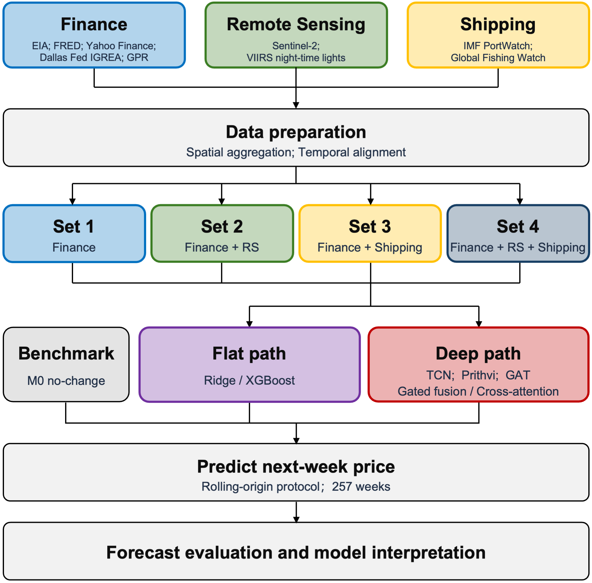
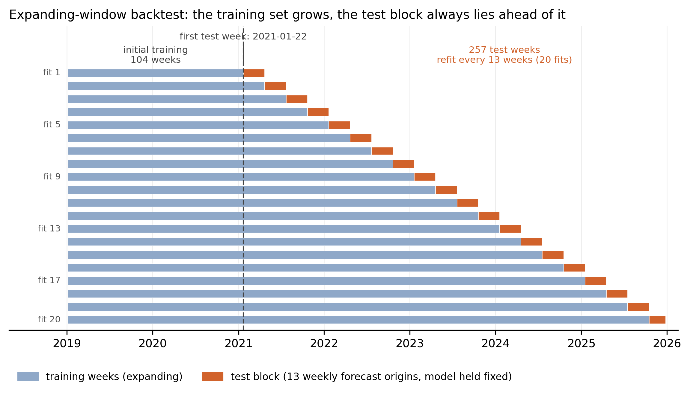
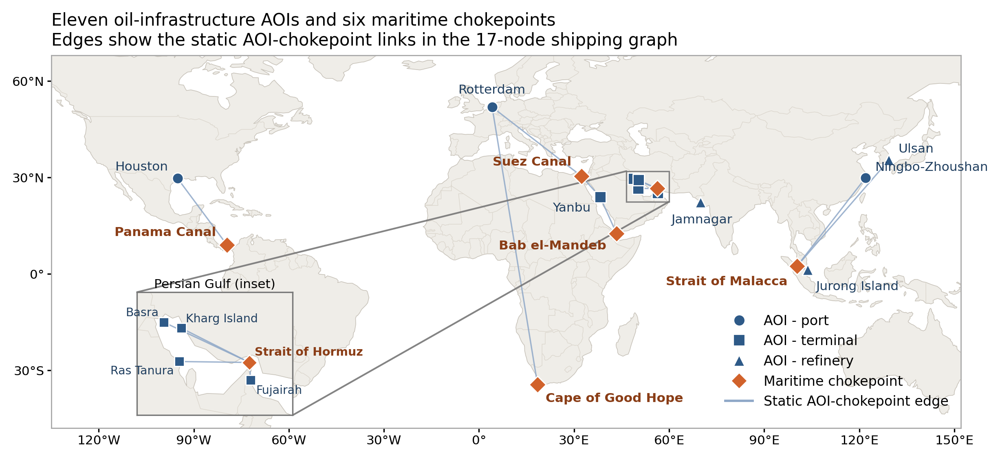
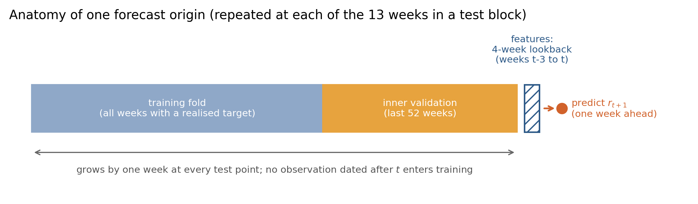

# Chapter 3 — Methodology *(~3,200)*

## 3.1 Research design

This chapter sets out how the study answers the research questions in Section 1.2. In brief, every learned forecast is judged against a simple no-change benchmark in which next week’s Brent price equals this week’s price. The study then asks whether remote sensing and shipping add useful information beyond financial time series, and whether modelling those inputs as one weekly table differs from encoding each data type separately before combining them. All comparisons use the same weekly forecast dates, sample window and evaluation rules, so that changes in the data can be separated from changes in how the data are modelled.

本章说明研究如何回答第 1.2 节的研究问题。简言之，每个学习到的预测都对照一个简单的不变预测基准，即下周 Brent 价格等于本周价格。研究再问遥感与航运是否在金融时序之外仍提供有用信息，以及把这些输入压成一张周表建模是否不同于先按数据类型分别编码再组合。所有比较共用同一周度预测日、样本窗口与评估规则，从而把“用了什么数据”的变化，与“如何建模”的变化分开。

The no-change benchmark is denoted M0. At each forecast origin t, where P_t is the Brent price in week t, M0 sets the one-week-ahead price forecast equal to the current weekly price:

\hat{P}_{t+1|t}=P_t.

M0 needs no parameter estimation and contains no predictors. It is a reference forecast, not one of the learned specifications below. Every learned model is compared with M0 over the same out-of-sample evaluation period. Once models predict log returns and then reconstruct prices, M0 is the same as forecasting a zero return.

不变预测基准记为 M0。设 P_t 为第 t 周的 Brent 价格，则在每个预测起点 t，M0 将提前一周的价格预测设为当前周价格：

\hat{P}_{t+1|t}=P_t.

M0 无需参数估计，也不含预测变量。它是参照预测，不属于下文经过学习的设定。每个学习模型都在同一样本外评价期上与 M0 比较。在先预测对数收益再还原价格时，M0 与预测收益为零是同一回事。

The predictors are organised into four information sets. S1 contains financial time series only, comprising financial, macroeconomic and oil-market variables. S2 adds remote sensing to S1, S3 adds shipping to S1, and S4 adds both modalities. S2 and S3 are parallel extensions of S1 rather than successive stages, while S4 combines the two. Table 3.1 lists the four sets together with the M0 benchmark.

预测变量组织为四个信息集。S1 仅用金融时序（金融、宏观与油市序列）。S2 在 S1 上加遥感；S3 在 S1 上加航运；S4 两者都加。S2 与 S3 是对 S1 的平行扩展，不是一条梯子上的先后步骤；S4 合并两支扩展。表 3.1 将四个集合与 M0 基准一并列出，M0 不含预测变量。

**Table 3.1 — Information sets**

**表 3.1 — 信息集**

| Set            | Variables                                                                   |
| -------------- | --------------------------------------------------------------------------- |
| Benchmark (M0) | Last week's price                                                           |
| S1             | Financial time series only (financial, macroeconomic and oil-market series) |
| S2             | S1 + remote sensing                                                         |
| S3             | S1 + shipping                                                               |
| S4             | S1 + remote sensing + shipping                                              |

Comparing S2 with S1 measures the contribution of remote sensing when added alone. Comparing S3 with S1 measures the contribution of shipping. Comparing S4 with S1 evaluates their joint contribution. Two further comparisons ask whether each source still helps once the other is already included. S4 versus S3 tests remote sensing given shipping, and S4 versus S2 tests shipping given remote sensing. All comparisons keep the same one-week horizon and Friday weekly calendar.

将 S2 与 S1 比较，度量单独加入遥感的贡献；S3 对 S1 度量航运的贡献；S4 对 S1 评估二者合用的贡献。另两组比较问在已有另一数据源时这一源是否仍有帮助。S4 对 S3 看已有航运时的遥感，S4 对 S2 看已有遥感时的航运。所有比较保持同一提前一周预测期与周五周历。

Two model families are applied to these information sets. The Flat family puts all selected predictors into one weekly table—stacking recent weeks into a single row—and fits Ridge and XGBoost. This early joining of features is called flat feature fusion. The Deep family keeps each data type separate at first. Financial series, remote-sensing imagery and shipping-network inputs each pass through their own encoder, and the outputs are then combined. The main Deep design learns how much weight to give each data type (gated fusion). Simple joining of the encoder outputs, and an attention-based alternative, are kept as comparisons. Flat and Deep share the same monitoring sites and forecast dates, but their remote-sensing inputs differ: Flat uses site-level optical indices together with night-time lights, whereas Deep uses learned embeddings of the image patches at the same sites and does not use night-time lights (Table 3.2). That difference is treated as part of the Flat–Deep contrast.

两套模型族应用于这些信息集。Flat 族把所选预测变量压成一张周度表——把最近几周叠成一行——再拟合 Ridge 与 XGBoost。这种一开始就合并特征的做法，称为扁平特征融合。Deep 族则先按数据类型分开处理。金融序列、遥感影像与航运网络输入各自经过自己的编码器，再把输出组合起来。Deep 的主设计学习给各类数据多少权重（门控融合）。编码器输出的简单拼接，以及一种基于注意力的备选，作为对照。Flat 与 Deep 共享同一监测站点与预测日，但两者的遥感输入不同：Flat 使用站点级光学指数并配合夜光，Deep 则使用同一站点影像块的学习嵌入且不含夜光（见表 3.2）。该差异视为 Flat–Deep 对照的一部分。

Paired Flat–Deep comparisons measure the overall difference between two modelling strategies. One fits a single weekly table directly; the other encodes each data type separately before combining the resulting representations. The information set, forecast dates and evaluation sample are held constant. However, because the two families also differ in model class and capacity, these comparisons are not interpreted as isolating the effect of fusion alone. Fusion itself is assessed within the Deep family by comparing simple concatenation, gated fusion and cross-attention while holding the encoders and input data fixed.

Flat 与 Deep 的配对比较，衡量的是两种整体建模策略的差异。一种是一张周表直接建模，另一种先按数据类型分别编码，再把得到的表征组合起来。比较时信息集、预测日与评价样本保持不变。但两族所用模型类型与容量也不同，因此这一比较不能解释为单独分离出融合方式的作用。融合方式本身在 Deep 族内部评估：在编码器与输入数据保持不变的前提下，比较简单拼接、门控融合与交叉注意力。

The research questions map onto the design as follows. RQ1 uses the S1–S4 comparisons within each model family, together with comparisons of every learned forecast against M0. The S4–S3 and S4–S2 contrasts test whether either additional source remains informative once the other is already included.

研究问题与设计的对应如下。RQ1 依靠各模型族内部的 S1–S4 比较，以及每个学习模型相对于 M0 的比较。S4–S3 与 S4–S2 的对比进一步检验：当另一类数据已经纳入后，新增的数据源是否仍能提供预测信息。

RQ2 uses two complementary comparisons. The first compares Flat and Deep models on matched information sets, forecast dates and evaluation samples—for example, S3_Flat versus S3_Deep—and therefore captures the overall difference between the two modelling strategies. The second compares simple concatenation, gated fusion and cross-attention within the Deep family and more directly assesses the fusion mechanism.

RQ2 使用两个互补层次的比较。第一层在匹配的信息集、预测日和评价样本上比较 Flat 与 Deep，例如 S3_Flat 与 S3_Deep，因此衡量的是两种整体建模策略的差异。第二层在 Deep 族内部比较简单拼接、门控融合与交叉注意力，从而更直接地评估融合机制本身。

RQ3 is restricted to Deep models that improve on M0 according to the predefined criterion. These models are identified from the results rather than selected in advance by name. For them, the study reports the weights assigned to finance, remote sensing and shipping, together with the sites or network nodes receiving greater attention under different market conditions. These quantities indicate what the model relies on; they are not interpreted as evidence of causal importance.

RQ3 仅限于按照预先设定准则优于 M0 的 Deep 模型。这些模型根据结果确定，而不是事先按名称选定。对这些模型，本研究报告其赋予金融、遥感和航运输入的权重，以及不同市场条件下受到更多关注的站点或网络节点。这些量说明模型依赖哪些信息，但不被解释为因果重要性的证据。

Figure 3.1 summarises the design and shows how the information sets, the two model families and the shared evaluation procedure connect to the three research questions.

图 3.1 概括整体设计，说明信息集、两套模型族与共用评估程序如何连向三个研究问题。

**Figure 3.1 — Research design: data blocks, the M0 benchmark and information sets S1–S4, the Flat and Deep families, and the shared expanding-window evaluation.**

**图 3.1 — 研究设计：数据块、M0 基准与信息集 S1–S4、Flat 与 Deep 两族，以及共用的扩展窗评估。**

## 3.2 Prediction target and timeline

## 3.2 预测目标与时间轴

Let P_t denote the last available daily Brent spot-price observation in week t, where each week ends on Friday, measured in US dollars per barrel. The quantity reported in the results is the one-week-ahead price P_{t+1}. Models are not trained directly on the price level. They predict the one-week logarithmic return

r_{t+1}=\log\left(\frac{P_{t+1}}{P_t}\right)

and reconstruct the price forecast as

\hat{P}*{t+1|t}=P_t\exp\left(\hat{r}*{t+1|t}\right).

Log returns are used to reduce the strong persistence in the price level and to express the forecasting task in terms of proportional weekly changes. RMSE, MAE and skill versus M0 are computed from the reconstructed price forecasts. Under this mapping, the no-change benchmark \hat{P}*{t+1|t}=P_t is exactly the same as forecasting a zero return \hat{r}*{t+1|t}=0.

令 P_t 表示第 t 个周五截止周内最后一个可获得的 Brent 现货价格日度观测值，单位为美元/桶。结果中报告的量是提前一周的价格 P_{t+1}。模型不直接在价格水平上训练，而是预测一周对数收益

r_{t+1}=\log\left(\frac{P_{t+1}}{P_t}\right),

并按

\hat{P}*{t+1|t}=P_t\exp\left(\hat{r}*{t+1|t}\right)

重构价格预测。使用对数收益是为了减弱价格水平序列的强持续性，并将预测任务表示为周度比例变化。RMSE、MAE 以及相对 M0 的 skill 均根据重构后的价格预测计算。在此对应关系下，不变预测基准 \hat{P}*{t+1|t}=P_t 与预测收益为零 \hat{r}*{t+1|t}=0 完全一致。

All series are organised on a Friday-ending weekly calendar. The modelling window covers 2019–2025 and provides a common weekly index of 365 observations (4 January 2019 to 26 December 2025). Flat models use a merged weekly feature table on this index. Deep models use the same dates, but keep financial, remote-sensing and shipping inputs in their own sequence or graph form rather than one shared table.

全部序列按周五截止的周历组织。建模窗口覆盖 2019–2025 年，提供含 365 个观测的共同周索引（2019 年 1 月 4 日至 2025 年 12 月 26 日）。Flat 模型在该索引上使用合并后的周度特征表。Deep 模型使用相同日期，但把金融、遥感与航运输入各自保留为序列或图形式，而不是并成一张共享表。

**With a four-week input window and a one-week forecast horizon, the 365 weekly observations yield 361 eligible input–target sequences. The first three observations cannot yet form a complete four-week input sequence, while the observation dated 26 December 2025 is used only as the target of the final forecast and cannot itself serve as a forecast origin. The first 104 eligible sequences are used for initial estimation. This leaves 257 out-of-sample forecast origins, dated from 22 January 2021 to 19 December 2025, with corresponding target dates from 29 January 2021 to 26 December 2025. At each origin t the model forecasts P_{t+1} using only information observable by that date. The estimation–evaluation split is temporal rather than random, and the sample is never shuffled. Evaluation follows a walk-forward design rather than a single fixed train–test split: model parameters are re-estimated every 13 forecast origins using only input–target pairs whose targets were observable by the corresponding re-estimation date, and the fitted parameters are retained between scheduled re-estimations. Consequently, no target observation enters the estimation sample used to generate its own forecast, although it may be included at a later re-estimation date once it has been realised (Section 3.9).**
是不是太复杂了？

在四周输入窗与提前一周预测期下，365 个周度观测可产生 361 个合法的"输入–目标"样本：最前面 3 个观测尚不足以构成完整的四周输入序列，而 2025 年 12 月 26 日的观测只作为最后一次预测的目标，其本身不能再作为预测起点。前 104 个合法样本用于初始估计，由此剩余 257 个样本外预测起点，日期为 2021 年 1 月 22 日至 2025 年 12 月 19 日，对应的目标日期为 2021 年 1 月 29 日至 2025 年 12 月 26 日。在每个起点 t，模型仅使用该日期已可观测的信息来预测 P_{t+1}。估计与评估按时间划分，而非随机划分，样本不做打乱。评估采用向前滚动设计，而不是一次性的固定训练/测试划分：模型参数每 13 个预测起点重估一次，重估时仅使用目标在该重估日期之前已可观测的"输入–目标"样本，两次重估之间沿用已拟合的参数。因此，任何目标观测都不会进入产生其自身预测的估计样本；但在该观测实现之后，它可以在之后的重估中被纳入（详见第 3.9 节）。

Figure 3.2 places this split on the weekly calendar: the training set expands with each re-estimation, and every test block lies ahead of the data used to fit it.

图 3.2 把这一划分放到周历上：训练集随每次重估向前扩展，而每个测试块始终位于其拟合所用数据之后。

**Figure 3.2 — Estimation and evaluation on the weekly calendar: the initial estimation period, the 20 re-estimation blocks and the 257 evaluated forecast origins.**

**图 3.2 — 周历上的估计与评估划分：初始估计期、20 个重估区块与 257 个纳入评估的预测起点。**

## 3.3 Geographic scope and monitoring sites

## 3.3 地理范围与监测站点

Because the prediction target is the global Brent benchmark rather than a local physical cargo price at a single terminal, the study does not use one contiguous study region. Spatial information instead comes from eleven oil-infrastructure monitoring sites and six maritime chokepoints. Together they cover major supply, transit and demand locations in the international oil system. Figure 3.3 places these sites and chokepoints on a world map. Full site names, coordinates, patch sizes and graph edge definitions are in Appendix A.

由于预测对象是全球 Brent 基准价格，而非单一码头的现货成交价格，本研究不采用一块连续的地理研究区。空间信息来自十一个油气基础设施监测站点与六个航运咽喉，共同覆盖国际石油体系中的主要供给、中转与需求区位。图 3.3 在世界地图上标出这些站点与咽喉。完整站名、坐标、裁剪范围与图边定义见附录 A。

The eleven sites are ports, refineries and export terminals chosen for infrastructure capacity, geographic and supply-chain coverage, and observability in the available satellite products. In the Flat pathway, remote-sensing features are summarised inside a 5-km circular buffer around each site. In the Deep pathway, image patches are cut around each site. Patch size follows facility type and local spatial constraints. Ports use larger patches, refineries intermediate ones, and terminals smaller ones.

十一个站点为港口、炼厂与出口码头，选择时兼顾基础设施产能、地理与供应链覆盖，以及在可用卫星产品中的可观测性。Flat 路径在每个站点周围 5 km 圆形缓冲区内汇总遥感特征。Deep 路径则按站点裁剪影像块。裁剪大小随设施类型与当地空间条件变化。港口较大，炼厂居中，码头较小。

The shipping network adds six chokepoints to the eleven sites. They are the Strait of Hormuz, the Suez Canal, the Strait of Malacca, Bab el-Mandeb, the Panama Canal and the Cape of Good Hope. This gives a weekly network with seventeen nodes. Two kinds of link are used. First, directed site-to-site links record observed voyages between the eleven AOIs from Global Fishing Watch port-visit sequences. The weekly link weight is the voyage count for each origin–destination pair, so these links change from week to week. Second, fixed site–chokepoint links connect each AOI to the chokepoint(s) on its main oil-trade corridor. These links are set in advance. They are not inferred from weekly vessel tracks or nearest-neighbour distance. PortWatch and Automatic Identification System (AIS) measures enter mainly as node attributes rather than as pairwise links.

航运网络在十一个站点之外加入六个咽喉，分别为霍尔木兹海峡、苏伊士运河、马六甲海峡、曼德海峡、巴拿马运河与好望角。由此形成含十七个节点的周度网络。边分为两类。第一类是站点之间的有向连接，来自 Global Fishing Watch 港口访问序列所记录的航次。每周边权为各起点–终点对的航次数，因此这些边随周变化。第二类是站点与咽喉之间的固定连接，按各站主贸易走廊事先指定，而非由周度船舶轨迹或最近邻距离推断。PortWatch 与船舶自动识别系统（AIS）测度主要作为节点属性进入，而不是成对连接。

Flat and Deep use the same underlying port and chokepoint observations and the same weekly forecast dates. Flat turns them into tabular predictors. Deep keeps the node structure and the links between nodes.

Flat 与 Deep 使用相同的港口与咽喉底层观测，并共享同一周度预测日。Flat 将其整理为表格预测变量。Deep 则保留节点结构及节点之间的连接。

**Figure 3.3 — Study sites: 11 oil-infrastructure AOIs and 6 maritime chokepoints.**

**图 3.3 — 研究站点：11 个油气基础设施 AOI 与 6 个航运咽喉。**

## 3.4 Data sources

## 3.4 数据来源

Three data blocks enter the design. They are financial time series (financial, macroeconomic and oil-market series), satellite remote sensing, and maritime shipping. Flat and Deep share the same Friday calendar and the same study sites and shipping-network scope. The product used for each block before it enters a model may differ (Table 3.2). For Flat models, the predictors are those in the merged weekly feature table. Deep models use the same weekly dates, but keep each block in its own input form.

三类数据块进入设计，分别为金融时序（金融、宏观与油市序列）、卫星遥感与航运。Flat 与 Deep 使用同一周五日历与相同的研究站点/航运网络范围。各块在进入模型前所用产品可以不同（见表 3.2）。Flat 所用预测变量以合并周度特征表为准。Deep 使用相同周日期，但把各块保留为各自的输入形式。

**Table 3.2 — Datasets, variables and sources**

**表 3.2 — 数据集、变量与来源**

| Modality                   | Dataset / product                                      | Key variables                                                               | Source                                       |
| -------------------------- | ------------------------------------------------------ | --------------------------------------------------------------------------- | -------------------------------------------- |
| Financial time series (S1) | Oil-market and macro weekly series                     | Prices, inventories, production, interest rates, GPR and related indicators | EIA, FRED, Yahoo Finance and related sources |
| Remote sensing (Flat)      | Sentinel-2 optical indices and VIIRS night-time lights | Site-level anomalies at 11 AOIs (NDVI, NDWI, NDBI, BSI; NTL)                | Sentinel-2; VIIRS                            |
| Remote sensing (Deep)      | Frozen Prithvi-EO-2.0 embeddings                       | Monthly Sentinel-2 image-patch embeddings at the same 11 AOIs (no VIIRS)    | Prithvi-EO-2.0 / Sentinel-2                  |
| Shipping (Flat)            | PortWatch and AIS tabular features                     | Port and chokepoint tanker flows; vessel-activity features                  | IMF PortWatch; AIS                           |
| Shipping (Deep)            | Same sources, represented as a graph                   | Weekly heterogeneous graph with 17 nodes (11 AOIs and 6 chokepoints)        | PortWatch; AIS                               |

| 模态       | 数据集 / 产品                  | 关键变量                                       | 来源                          |
| -------- | ------------------------- | ------------------------------------------ | --------------------------- |
| 金融时序（S1） | 油市与宏观周序列                  | 价格、库存、产量、利率、GPR 及相关指标                      | EIA、FRED、Yahoo Finance 等    |
| 遥感（Flat） | Sentinel-2 光学指数与 VIIRS 夜光 | 11 个 AOI 的站点级异常（NDVI、NDWI、NDBI、BSI；NTL）    | Sentinel-2；VIIRS            |
| 遥感（Deep） | 冻结 Prithvi-EO-2.0 嵌入      | 同一 11 个 AOI 的月度 Sentinel-2 影像块嵌入（不含 VIIRS） | Prithvi-EO-2.0 / Sentinel-2 |
| 航运（Flat） | PortWatch 与 AIS 表格特征      | 港口与咽喉油轮流量；船舶活动特征                           | IMF PortWatch；AIS           |
| 航运（Deep） | 同源数据，图表示                  | 含 17 个节点的周度异质图（11 个 AOI 与 6 个咽喉）           | PortWatch；AIS               |

The financial block is assembled from weekly oil-market and macro-financial series from the US Energy Information Administration (EIA), Federal Reserve Economic Data (FRED), Yahoo Finance and related scholarly indicators. The series include crude prices and spreads, inventories, production and refinery activity, volatility and risk measures, interest rates, exchange rates, futures-based oil indicators and geopolitical risk. This block is S1 before remote sensing or shipping is added. In the Deep pathway it is treated as one input stream for the finance encoder, even though the predictors extend beyond prices alone.

金融块由美国能源信息署（EIA）、联邦储备经济数据（FRED）、Yahoo Finance 及相关学术指标的周度油市与宏观金融序列汇总而成，包括原油价格与价差、库存、产量与炼厂活动、波动与风险度量、利率、汇率、基于期货的油市指标以及地缘政治风险。该块即加入遥感或航运前的 S1。在 Deep 路径中，它作为金融编码器的一路输入，尽管预测变量远不止价格本身。

Remote-sensing inputs are observed over the eleven AOIs. Flat and Deep share these sites but use different products from a common Sentinel-2 optical source family. Flat remote sensing uses monthly Sentinel-2 optical indices (NDVI, NDWI, NDBI and BSI) together with VIIRS night-time lights, converted to site-level anomalies. Deep remote sensing uses frozen Prithvi-EO-2.0 embeddings extracted from monthly Sentinel-2 image patches at the same AOIs and excludes VIIRS. Early Deep trials that included VIIRS night-time lights were noisy and added little useful signal; keeping them worsened performance, so VIIRS was dropped from the Deep pathway. Systematic numerical ablations from those early trials were not retained. This choice is also consistent with evidence that night-time lights capture cross-sectional brightness differences better than within-site temporal variation (Small, 2021). The reported Deep pathway therefore uses Sentinel-2 image embeddings only. Shared AOIs keep spatial coverage matched across pathways. Differences in product and representation form part of the Flat–Deep contrast and limit a pure architecture comparison on identical remote-sensing features.

遥感输入观测于十一个 AOI。Flat 与 Deep 共享这些站点，但使用来自共同 Sentinel-2 光学源族的不同产品。Flat 遥感采用月度 Sentinel-2 光学指数（NDVI、NDWI、NDBI 与 BSI）及 VIIRS 夜光，并转换为站点级异常。Deep 遥感采用同一站点上月度 Sentinel-2 影像块提取的冻结 Prithvi-EO-2.0 嵌入，且不含 VIIRS。早期 Deep 试验曾纳入 VIIRS 夜光，但噪声大、有效信息少，保留后表现变差，因此从 Deep 路径剔除。这些早期试验的系统数值消融结果未保留。这一选择也与文献一致：夜光更擅长跨地点亮度差异，站点内时间变异较难解释（Small, 2021）。故正文报告的 Deep 路径仅使用 Sentinel-2 影像嵌入。共享 AOI 使两条路径的空间覆盖保持匹配。产品与表征差异构成 Flat–Deep 对照的一部分，并限制在完全相同遥感特征上的纯架构比较。

Shipping inputs combine IMF PortWatch measures of chokepoint and port tanker flows with AIS-derived vessel-activity indicators for the network in Section 3.3. In the Flat pathway these signals enter as weekly table features. In the Deep pathway they enter as the seventeen-node network already described. In both pathways, shipping is treated as a proxy for physical trade and congestion rather than as a direct measure of next week’s price.

航运输入结合 IMF PortWatch 的咽喉与港口油轮流量测度，以及第 3.3 节网络的 AIS 衍生船舶活动指标。Flat 路径中，这些信号以周度表格特征进入。Deep 路径中，它们进入前文所述的十七节点网络。两条路径都将航运视为实物贸易与拥堵的代理，而非下周价格的直接量测。

## 3.5 Temporal alignment, lags, missingness

## 3.5 时间对齐、滞后期与缺失

All series are aligned to the Friday-ending weekly calendar. Predictors enter only after their real publication time, so the model never uses future information at any forecast origin. Release lags differ across sources. EIA and PortWatch series typically become available with a lag of about one week, while slower monthly series require longer buffers before they are allowed to enter. Missingness is handled differently in the two pathways. Flat models fill missing values using only past observations within the available history. Deep models keep an explicit missing marker for absent modalities or sites instead of filling them in silently, so the model can see what was unavailable at that forecast date.

全部序列对齐到周五截止周历。预测变量仅在真实发布时刻之后进入，因此任一预测起点都不会使用未来信息。不同来源的发布滞后不同。EIA 与 PortWatch 序列通常约一周后可用，更慢的月度序列则需要更长缓冲才允许进入。缺失处理在两条路径中不同。Flat 模型仅用可得历史中的过去观测填补缺失。Deep 模型对当时缺失的模态或站点保留显式缺失标记，而不是悄悄填掉，从而使模型知道该预测日缺少什么。

## 3.6 Flat models

## 3.6 Flat 模型

Flat models implement flat feature fusion. For a given information set, all available numeric features are concatenated into one weekly table, and the most recent four weeks are flattened into a single row for each forecast origin. Two learners are estimated on this table. Ridge is a linear model with L2 regularisation (Hoerl and Kennard, 1970) and serves as a transparent linear baseline that combines features at the outset. XGBoost is a non-linear gradient-boosted tree ensemble (Chen and Guestrin, 2016) that can capture interactions missed by Ridge, but still does not preserve modality-specific structure. Regularised linear and tree-based learners are both common in short-horizon oil-price forecasting with large predictor sets (Costa et al., 2021; Yılmaz and Zehir, 2026); they are used here as Flat baselines rather than as a claim that either algorithm is universally optimal. Both models predict the one-week-ahead log return and then reconstruct price. Hyperparameters are chosen inside each training fold on past validation weeks only. Exact search grids are in Appendix C.

Flat 模型实现扁平特征融合。对给定信息集，将全部可用数值特征拼成一张周表，并在每个预测起点将最近四周压成一行。该表上估计两种学习器。Ridge 是带 L2 正则的线性模型（Hoerl and Kennard, 1970），作为一开始就合并特征的透明线性基线；XGBoost 是非线性梯度提升树集成（Chen and Guestrin, 2016），可捕捉 Ridge 错过的交互，但仍不保留各模态特有结构。正则化线性与树模型在大预测变量集的短期限油价预测中均常见（Costa et al., 2021; Yılmaz and Zehir, 2026）；此处用作 Flat 基线，而非声称任一算法普遍最优。二者均预测提前一周的对数收益，再还原价格。超参数仅在各训练折内、用过去验证周选择。精确搜索网格见附录 C。

## 3.7 Deep models

## 3.7 Deep 模型

Deep models use the same information sets, Friday calendar and validation protocol as Flat. The difference is how inputs are represented and combined, not the forecast target. Each available modality is first turned into a fixed-size representation; those representations are then combined into one forecast. The three encoders are described below by input, purpose and output.

Deep 模型与 Flat 使用相同的信息集、周五日历与验证协议。差异在输入如何被表征与组合，而非预测目标。每个可用模态先转为固定维度的表征，再把这些表征组合成一次预测。下文三个编码器按输入、用途与输出说明。

**Finance encoder.** The input is the weekly financial time series block (S1), including prices, inventories, macro and oil-market indicators. These series are dense temporal sequences, so the encoder must learn short-run dependence without using future weeks. The output is one finance representation for the forecast origin. The architecture is a causal temporal convolutional network (TCN; Bai, Kolter and Koltun, 2018). Causal convolutions prevent look-ahead within the sequence, and TCNs have been competitive for short-horizon crude-price forecasting relative to several deep and tree baselines (Foroutan and Lahmiri, 2024).

**金融编码器。** 输入为周度金融时序块（S1），包括价格、库存、宏观与油市指标。这些序列是密集时间序列，编码器须在不使用未来周的前提下学习短期依赖。输出为该预测时点的一个金融表征。架构为因果时间卷积网络（TCN；Bai, Kolter and Koltun, 2018）。因果卷积避免序列内前瞻，且相对多种深度与树基线，TCN 在短期限原油价格预测中具有竞争力（Foroutan and Lahmiri, 2024）。

**Remote-sensing encoder.** The input is monthly Sentinel-2 image-patch embeddings at the eleven AOIs, extracted with a frozen Prithvi-EO-2.0 model (VIIRS night-time lights are excluded). Sites are kept distinct until after encoding, so spatial location is not collapsed into a single early average. The output is one remote-sensing representation for the forecast origin, formed by weighting across time and sites. The architecture uses frozen embeddings plus temporal and site attention.

**遥感编码器。** 输入为十一个 AOI 上的月度 Sentinel-2 影像块嵌入，由冻结的 Prithvi-EO-2.0 模型提取（不含 VIIRS 夜光）。编码完成前保持站点可区分，避免过早把空间位置压成单一均值。输出为该预测时点的一个遥感表征，由时间与站点加权得到。架构为冻结嵌入，外加时间与站点注意力。

**Shipping encoder.** The input is the weekly seventeen-node shipping network from Section 3.3. Shipping information is relational because ports and corridors are linked, so a graph model fits better than a flat row of counts. The output is one shipping representation for the forecast origin. The architecture is a graph attention network (GAT; Veličković et al., 2018) with temporal encoding. Graph neural networks have been used to model crude-oil and vessel-traffic networks as relational, time-varying processes (Ouyang et al., 2022; Liang et al., 2022). GAT is used here because neighbour weights fit a sparse port–chokepoint network and later support site-level interpretation (RQ3). Layer settings are in Appendix C.

**航运编码器。** 输入为第 3.3 节的周度十七节点航运网络。航运信息具有关系结构，因为港口与走廊相互连接，因此图模型比一行扁平计数更合适。输出为该预测时点的一个航运表征。架构为带时间编码的图注意力网络（GAT；Veličković et al., 2018）。图神经网络已用于将原油与船舶交通网络建模为关系性、时变过程（Ouyang et al., 2022; Liang et al., 2022）。此处采用 GAT，是因为邻居权重适合稀疏港口–咽喉网络，并便于后续站点级解释（RQ3）。层设置见附录 C。

**Fusion (RQ2).** Once each available modality has a representation, three ways of combining them are compared. Simple concatenation joins the representations without adaptive weighting and serves as a control. Gated fusion is the main reported design. It learns how much weight to give each modality. Cross-attention is retained as an advanced alternative that lets modalities attend to one another. The fused representation is mapped to the same return and price target as Flat. Training details are in Appendix C.

**融合（RQ2）。** 各可用模态得到表征后，比较三种组合方式。简单拼接在无自适应加权下连接表征，作为对照。门控融合是主要报告设计，它学习给各模态多少权重。交叉注意力保留为进阶备选，允许模态相互关注。融合表征映射到与 Flat 相同的收益与价格目标。训练细节见附录 C。

## 3.8 Hyperparameter selection

## 3.8 超参数选择

Hyperparameters are selected under a shared protocol so that Flat–Deep comparisons remain fair. For Flat models, tuning uses only past validation weeks inside each training fold. For Deep models, searching the full architecture at every fold is too costly. A limited search is run first, then one main configuration is fixed for the primary results. Sensitivity checks follow. Exact grids and layer settings are in Appendix C.

超参数在共享协议下选择，以使 Flat–Deep 比较保持公平。Flat 模型仅在各训练折内、用过去验证周调参。Deep 模型若在每一折都完整搜索架构成本过高，故先做有限搜索，再固定主配置作主要结果；随后做敏感性检查。细节见附录 C。

## 3.9 Validation protocol

## 3.9 验证协议

Evaluation uses an expanding window. Each fit uses only input–target pairs whose targets were already observable at the estimation date, and the fitted model then produces one-week-ahead forecasts. This design prevents the use of future information in training or preprocessing. The first 104 eligible input–target sequences form the initial estimation period and are not included in the evaluation metrics; the validation weeks used for tuning are taken from inside each training fold rather than from a separate held-out block. Thereafter models are refit every 13 forecast origins. The common evaluation span covers 257 weeks from 22 January 2021 to 19 December 2025. Any scaling or filtering is fit on the training period only. Flat and Deep share the same evaluation calendar, so architecture comparisons hold the evaluation design fixed.

评估采用扩展窗。每次拟合仅使用目标在该估计日期之前已可观测的"输入–目标"样本，随后由拟合好的模型给出提前一周预测。该设计避免在训练或预处理中使用未来信息。前 104 个"输入–目标"样本为初始估计期，不纳入评估指标；调参所用的验证周取自各训练折内部，而非另行划出的留出区块。此后每 13 个预测起点重拟合一次。共同评估跨度为 2021 年 1 月 22 日至 2025 年 12 月 19 日的 257 周。任何缩放或过滤仅在训练期内拟合。Flat 与 Deep 共享同一评估日历，从而使架构比较在固定评估设计下进行。

Figure 3.2 gives the calendar view of this design. Figure 3.4 shows one forecast origin in detail: the training fold, the inner validation weeks, the four-week input window and the one-week-ahead target.

图 3.2 给出该设计在日历上的整体视图。图 3.4 进一步展示单个预测起点的内部结构：训练折、内部验证周、四周输入窗与提前一周的目标。

**Figure 3.4 — Anatomy of one forecast origin: the training fold with its inner validation weeks, the four-week input window and the one-week-ahead target. The same structure is repeated at each of the 13 origins in a test block.**

**图 3.4 — 单个预测起点的结构：包含内部验证周的训练折、四周输入窗与提前一周的预测目标。测试块内的 13 个起点均重复这一结构。**

## 3.10 Evaluation, tests, interpretability

## 3.10 评估、检验与可解释性

Primary metrics are computed on reconstructed prices. Every comparison reports RMSE and MAE. Relative performance versus M0 is summarised by RMSE skill—the percentage improvement in RMSE relative to M0—reported as a percentage in the result tables.

\mathrm{Skill}=100\times\left(1-\frac{\mathrm{RMSE}*{\mathrm{model}}}{\mathrm{RMSE}*{\mathrm{M0}}}\right).

Skill greater than zero means the model beats M0 on RMSE. Skill equal to zero matches M0. Skill less than zero is worse than M0.

The study reports both absolute skill versus M0 and incremental value versus S1. Statistical tests are chosen by the type of comparison, not by the size of the modality set alone. Adding remote sensing or shipping enlarges the information set, but that does not by itself make two forecasts nested for testing. When one forecast specification is nested in another—for example Ridge S1 versus Ridge S2, S3 or S4 under the same learner—Clark–West (2007) is used to test whether the larger model improves mean squared prediction error. When the comparison is not nested—for example Flat versus Deep, or XGBoost versus a Deep setting that changes hyperparameters or architecture—Diebold–Mariano (1995) is used to test equal predictive accuracy. A small-sample adjustment is noted where relevant. Every comparison also reports RMSE and MAE differences versus M0 and, where relevant, versus S1.

Interpretability diagnostics are applied only to specifications that improve on M0. The main cases are Deep S3 and, where relevant, Deep S4. The diagnostics report modality gate weights together with site or node attention.

主指标在重构价格上计算。每次比较均报告 RMSE 与 MAE。相对 M0 的表现以 RMSE skill（相对 M0 的 RMSE 百分比改善）汇总，并在结果表中以百分比报告。

\mathrm{Skill}=100\times\left(1-\frac{\mathrm{RMSE}*{\mathrm{model}}}{\mathrm{RMSE}*{\mathrm{M0}}}\right).

Skill 大于零表示模型在 RMSE 上优于 M0。等于零与 M0 持平。小于零则差于 M0。

研究同时报告相对 M0 的绝对 skill 与相对 S1 的增量价值。统计检验按比较类型选择，而非仅按模态集大小。加入遥感或航运会扩大信息集，但这本身并不使两个预测在检验上嵌套。当一个预测设定嵌套于另一个时——例如在同一学习器下 Ridge S1 对 Ridge S2、S3 或 S4——使用 Clark–West（2007）检验较大模型是否改善均方预测误差。当比较不嵌套时——例如 Flat 对 Deep，或改变超参或架构的 XGBoost 与 Deep 设定——使用 Diebold–Mariano（1995）检验等预测精度。相关时注明小样本调整。每次比较亦报告相对 M0、以及相关时相对 S1 的 RMSE 与 MAE 差异。

可解释性诊断仅用于相对 M0 有改善的设定。主要为 Deep S3，以及相关时的 Deep S4。诊断报告模态门控权重与站点或节点注意力。

## 3.11 Ethics and reproducibility

## 3.11 伦理与可复现性

The study uses secondary aggregate data only and does not involve human participants. It was approved under the UCL low-risk ethics process. Two features of the data still require reflection. First, the AIS and Global Fishing Watch records identify individual vessels rather than individuals, and they are used here only in aggregate form, as weekly node attributes and origin–destination voyage counts for the seventeen-node network. No attempt is made to identify vessel owners, operators or crew, and no vessel-level results are reported. Second, satellite observation of oil ports, refineries and export terminals raises dual-use considerations, because the same imagery that supports market analysis also describes critical infrastructure. The study therefore uses only openly licensed moderate-resolution products—Sentinel-2 at 10 m and VIIRS night-time lights—at which individuals and operational detail are not discernible, and it observes publicly documented facility locations. Results are reported as site-level aggregates. The interpretability outputs in Section 3.10 describe where a model places weight; they are not assessments of any individual facility or operator. All datasets are used under their published terms for research use, including the Copernicus open licence for Sentinel-2, open distribution terms for VIIRS night-time lights, and the research terms of IMF PortWatch and Global Fishing Watch.

本研究仅使用二手汇总数据，不涉及人类参与者，并已按 UCL 低风险伦理流程获批。数据本身仍有两点需要说明。其一，AIS 与 Global Fishing Watch 记录识别的是船舶而非个人，且本研究仅以汇总形式使用，即十七节点网络的周度节点属性与起讫航次计数；不尝试识别船东、运营方或船员，也不报告单船层面的结果。其二，对油港、炼厂与出口码头的卫星观测涉及双重用途问题，因为支持市场分析的影像同样描述了关键基础设施。为此本研究仅使用开放许可的中等分辨率产品——10 m 的 Sentinel-2 与 VIIRS 夜光——在该分辨率下无法辨识个人与设施运行细节，且所观测的设施位置均为公开信息。结果以站点级汇总形式报告。第 3.10 节的可解释性输出说明模型把权重放在哪里，不构成对任何具体设施或运营方的评估。所有数据集均按其公开的研究使用条款使用，包括 Sentinel-2 的 Copernicus 开放许可、VIIRS 夜光的开放分发条款，以及 IMF PortWatch 与 Global Fishing Watch 的研究条款。

Analysis was carried out in Python. Data preparation, model estimation and evaluation are organised as scripted pipelines rather than manual steps, so that the weekly calendar, the expanding-window splits and the evaluation metrics are produced by the same code for every specification. Random seeds are fixed for the Deep models, and sensitivity to the seed is reported alongside the main results rather than left implicit. Package versions and exact configuration settings are listed in Appendix C. The code repository is private during writing and will be made available with the submitted dissertation.

分析使用 Python 完成。数据准备、模型估计与评估均以脚本化流程组织，而非手工步骤，从而使周历、扩展窗划分与评估指标在所有设定下都由同一套代码产生。Deep 模型固定随机种子，并将种子敏感性与主结果一并报告，而不是留作隐含假设。软件包版本与精确配置见附录 C。代码仓库在写作期间为私有，将随论文提交一并提供。

---

