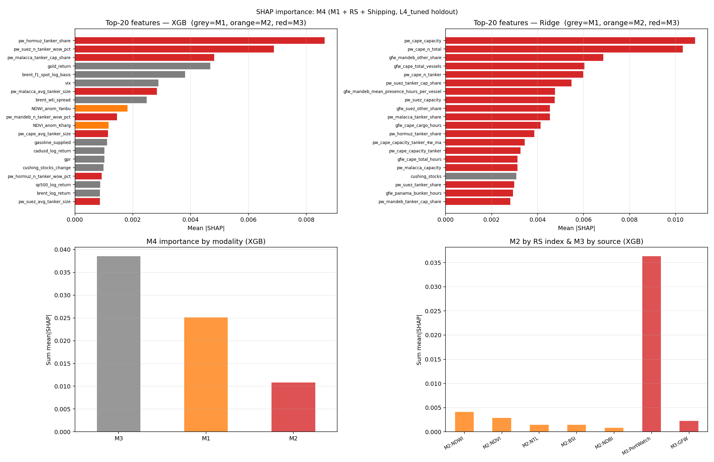

# Chapter 4 — Results

*(Draft v1, 2026-07-03. Numbers from `05_outputs/baselines/`; test window 257 weeks,
2021-01 to 2025-12. Figures referenced by relative path.)*

## 4.1 Exploratory data analysis

The prediction target — the weekly Brent log return — has a near-zero mean and pronounced volatility clustering, so the no-change random walk (M0) is an extremely strong benchmark: on the 257-week test set its price RMSE is **4.15 USD/barrel**, the number every learned model is measured against.

The mechanism-level EDA of the remote-sensing channel (Channel B) tempers expectations for the alternative modalities. Site-type composite anomalies (port / refinery / terminal) correlate only weakly with Brent returns (|corr| < 0.15), and most of the stronger correlations sit at **negative lags** — remote-sensing activity tends to react to, or move with, prices rather than lead them, a cautious signal for RQ1. The clearest exception is night-time-water dynamics at Middle-East export terminals (`NDWI_terminal`), which leads at lag +1 (Granger p = 0.029) but is fragile under multiple-comparison correction. This weak, mostly coincident structure is precisely why the study relies on formal Diebold–Mariano / Clark–West testing rather than visual inspection.

## 4.2 Model performance

All three model families were run under the identical locked protocol (2019–2026, lookback 4, expanding rolling-origin, single-task regression of \(r_{t+1}\) reconstructed to price). Table 4.1 reports every modality × model cell.

**Table 4.1 — M0–M4 out-of-sample performance (price RMSE, 257 test weeks)**

| Modality | Model | RMSE | MAE | DirAcc | Skill vs M0 | DM_p (beats M0) | CW_p (vs M1) |
|----------|-------|-----:|----:|-------:|------------:|----------------:|-------------:|
| **M0** | Random walk | **4.152** | 3.011 | – | 0.0% | – | – |
| M1 Finance | Ridge | 4.332 | 3.081 | 0.490 | −4.3% | 0.91 | – |
| | XGB | 4.771 | 3.406 | 0.525 | −14.9% | 0.98 | – |
| M2 +Remote sensing | Ridge | 4.411 | 3.208 | 0.518 | −6.3% | 0.96 | 0.212 |
| | XGB | 4.643 | 3.300 | 0.506 | −11.8% | 0.98 | **0.006** |
| M3 +Shipping | Ridge | 4.592 | 3.278 | 0.502 | −10.6% | 0.96 | 0.481 |
| | XGB | 4.456 | 3.227 | 0.498 | −7.3% | 0.96 | **2.5e-5** |
| M4 All | Ridge | 4.560 | 3.313 | 0.482 | −9.8% | 0.96 | 0.228 |
| | XGB | 4.470 | 3.284 | 0.502 | −7.7% | 0.99 | **1.7e-4** |

*Skill > 0 beats the random walk; DM_p is the one-sided p that the model beats M0 (< 0.05 = significantly better); CW_p is the Clark–West nested increment over M1 (< 0.05 = significant). Bold marks significant nested increments.*

Two patterns dominate. First, **no model beats M0** — every skill value is negative and no DM test is significant, confirming the difficulty of weekly Brent forecasting; among the learned models the tuned Ridge on the financial set stays closest to the random walk (M1 skill −4.3%). Second, **relative to the financial baseline M1, the added modalities do carry a statistically significant nested increment**: under XGBoost the Clark–West test is significant for M2 (p = 0.006), M3 (p = 2.5e-5) and M4 (p = 1.7e-4).

## 4.3 Key findings

**RQ1 — incremental value.** Remote sensing and shipping provide a *statistically significant nested increment* over the finance-only model under XGBoost (Clark–West: M2 p = 0.006, M3 p = 2.5e-5, M4 p = 1.7e-4), though the increment is model-dependent — it does not reach significance under the linear Ridge. However, this must be stated with an honest nuance: **a significant Clark–West increment over M1 is not the same as beating M0** — no configuration achieves positive skill against the random walk. The contribution of alternative data is therefore *detectable but modest* at the weekly horizon.

**RQ2 — flat vs modality-aware fusion.** Even within flat feature fusion, *how* a modality is handled already matters. The 119 high-dimensional shipping features yield a strongly significant increment under XGBoost (p = 2.5e-5) yet **no significant increment under the linear Ridge model** (p = 0.48), whose RMSE worsens to 4.59 — the high-dimensional, collinear shipping block overwhelms a flat linear model while the tree model can still exploit it. Whether a representation-level, modality-aware fusion extracts this signal more effectively than any flat baseline is precisely the question the contribution layer (Chapter 5) is designed to answer.

**Modality attribution (SHAP).** On the M4 XGBoost model, global mean-|SHAP| attributes **56% of predictive contribution to shipping, 31% to finance and 13% to remote sensing** (Figure 4.x, `../05_outputs/baselines/Flat/M4_Flat/shap_m4.png`), consistent with the chokepoint tanker signals (Hormuz/Suez) being the strongest non-price inputs.

**Robustness.** (i) Applying an MNDWI water mask to water-dominated export terminals *strengthens* the remote-sensing increment (M2 XGB Clark–West p = 0.006 → 8.5e-5), supporting the interpretation that water-surface noise had been diluting the optical indices. (ii) Leave-one-AOI-out shows that dropping most individual sites slightly *reduces* RMSE, i.e. the remote-sensing increment is **diffuse across sites rather than driven by any single AOI**, and warns against per-site overfitting. (iii) Both learned model families remain numerically stable under the shared protocol.

**Summary.** The core empirical layer establishes a credible, leakage-safe, three-family baseline in which (a) the random walk is unbeaten, (b) remote sensing and shipping nonetheless add significant nested information over finance, and (c) the linear-vs-tree contrast on the high-dimensional shipping block already signals that *how* modalities are combined matters — motivating the modality-aware contribution layer (Chapter 5).
