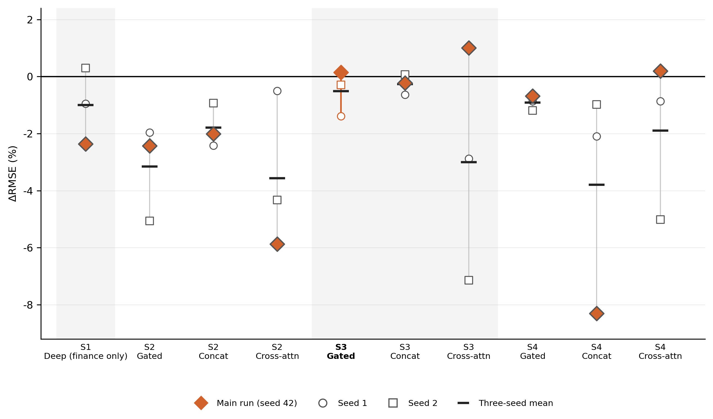

# Appendix B — Extra results & robustness / 附录 B — 额外结果与稳健性

All checks use the same protocol as Chapter 3 (lookback 4, expanding window, 257
scored weeks). 

---

## B.1 Deep fusion matrix / 深度融合矩阵

Entries are $\Delta\mathrm{RMSE}$ (%).
Positive values indicate lower RMSE than the no-change benchmark.

种子 42。表中为 $\Delta\mathrm{RMSE}$（%）。正值表示优于不变预测。

| Set                          | Concat | Gated     | Cross-attention |
| ---------------------------- | ------ | --------- | --------------- |
| S2 (finance + RS)            | −2.01  | −2.43     | −5.87           |
| **S3 (finance + shipping)**  | −0.22  | **+0.15** | **+1.00**       |
| S4 (finance + RS + shipping) | −8.30  | −0.68     | +0.19           |

M0 is cleared only where shipping is present. S2 never beats M0.
Concatenation clears M0 in no set. The three positive cells are descriptive
orderings on one seed.

本种子下，只有含航运的设定越过 M0；S2 从未优于 M0；拼接在任何集合上都未越过
M0。三个正值是单一种子上的描述性排序。跨种子均值见表 4.5；各次种子见 B.2。

---

## B.2 Random-seed robustness / 随机种子稳健性

Three random seeds (42, 1 and 2) for every Deep specification in Table 4.5.
The main seed-42 run is marked with a diamond. Means remain negative for all
specifications; only five of thirty individual runs are positive.

三个随机种子（42、1、2）对应表 4.5 的全部 Deep 设定。主运行（种子 42）以菱形标出。
所有设定的跨种子均值均为负；三十次运行中只有五次为正。

**Figure B.1 — Random-seed robustness of Deep specifications: individual seeds and means relative to M0. The main seed-42 run is marked with a diamond.**

**图 B.1 — Deep 设定的随机种子稳健性：各次种子结果及其均值相对 M0。主运行（种子 42）以菱形标出。**

---

## B.3 Matched Flat–Deep comparisons / 匹配 Flat–Deep 比较

Same eight pairs as Table 4.3. Improvement is the Deep RMSE reduction relative
to the matched Flat model, 100\times(1-\mathrm{RMSE}*\text{Deep}/\mathrm{RMSE}*\text{Flat}).
Positive values indicate a lower Deep RMSE. *p* is the probability of a
difference at least this large if the two models had the same RMSE. Smaller *p*
indicates stronger evidence that their RMSEs differ. *n* = 257.

与表 4.3 相同的八组配对。改善为 Deep 相对匹配 Flat 的 RMSE 降幅。正值表示
Deep 的 RMSE 更低。*p* 为两模型 RMSE 相同这一假设下，出现至少如表所示差异的
概率。*p* 越小，越不支持二者误差相同。

| Feature set | Flat  | Deep       | Improvement (%) | *p*   |
| ----------- | ----- | ---------- | --------------- | ----- |
| S1          | Ridge | Deep       | +0.15           | 0.466 |
| S1          | XGB   | Deep       | +2.71           | 0.097 |
| S2          | Ridge | Deep gated | +3.64           | 0.096 |
| S2          | XGB   | Deep gated | +4.22           | 0.042 |
| S3          | Ridge | Deep gated | +8.95           | 0.021 |
| S3          | XGB   | Deep gated | +4.85           | 0.104 |
| S4          | Ridge | Deep gated | +7.90           | 0.027 |
| S4          | XGB   | Deep gated | +5.26           | 0.074 |

All eight pairs favour Deep. Three have *p* below 0.05.

八组均有利于 Deep，其中三组 *p* 低于 0.05。

---

## B.4 Publication-lag sweep / 发布滞后扫描

Locked as-of lags are GFW monthly presence +4 weeks and monthly macro +5 weeks
(Appendix A.3). Alternative lags are an extra calendar shift on already-lagged
series. *n* = 257.

锁定滞后见附录 A.3。备选滞后是在已滞后序列上再平移。

**GFW monthly presence (Flat S3)**

| Lag (weeks)    | Ridge RMSE | $\Delta\mathrm{RMSE}$ (%) | XGB RMSE  | $\Delta\mathrm{RMSE}$ (%) | XGB *p* vs S1 |
| -------------- | ---------- | --------------------- | --------- | --------------------- | ------------- |
| 1              | 4.478      | −7.85                 | 4.693     | −13.03                | 0.945         |
| **4 (locked)** | **4.553**  | **−9.66**             | **4.357** | **−4.94**             | **0.471**     |
| 8              | 4.464      | −7.52                 | 4.323     | −4.13                 | 0.382         |

**Monthly macro (Flat S1: REA and non-oil commodity)**

| Lag (weeks)    | Ridge RMSE | $\Delta\mathrm{RMSE}$ (%) | XGB RMSE  | $\Delta\mathrm{RMSE}$ (%) |
| -------------- | ---------- | --------------------- | --------- | --------------------- |
| 3              | 4.255      | −2.49                 | 4.399     | −5.95                 |
| **5 (locked)** | **4.256**  | **−2.52**             | **4.368** | **−5.22**             |
| 7              | 4.245      | −2.23                 | 4.388     | −5.68                 |

No lag beats M0. Shortening GFW to +1 week makes XGBoost substantially worse.
Monthly-macro lag moves S1 by at most 0.03 RMSE. The locked buffers are not the
reason Flat models with spatial features fail to clear M0.

没有任何滞后优于 M0。GFW 缩为 +1 周使 XGBoost 明显变差。月度宏观滞后最多移动
0.03 RMSE。锁定缓冲不是 Flat 另类数据未能越过 M0 的原因。
